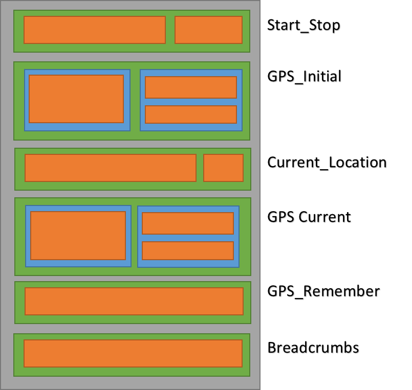
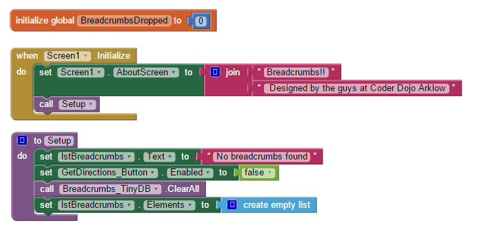

# Breadcrumbs for App Inventor 2

Never get lost again. Found yourself touring in a new location and want
to make sure you can make your way back to where you started? Use this
app to drop virtual “breadcrumbs” as you move around and when you’re
ready to retrace your steps, get directions from Google Maps.

# Learning Goals

After using this tutorial you should be able to

  - Use layout components to arrange the various objects on screen
  - Add data to list components
  - Save data using TinyDB and retrieve it when needed
  - Access the App Inventor LocationSensor component
  - Access the App Inventor ActivityStarter component

# Outline

1.  Setup App Inventor -
    <http://appinventor.mit.edu/explore/ai2/setup.html>
2.  Create the Layout components
3.  Using the app, dropping breadcrumbs
4.  Using the app, find your way back

# Create the app layout.

The App screen layout is made up by combining a number of Horizontal and
Vertical Layout components. Use a horizontal arrangement component to
display a group of components laid out from left to right.Use a vertical
arrangement component to display a group of components laid out from top
to bottom, left-aligned. Most apps will require a mix of Horizontal and
Vertical Layout components to make sure that controls are layed out in a
way that makes senses for the particular app.

This app contains 6 Vertical Layout components, each of which may
contain a number of Horizontal Layout components, or one or more
controls. In the diagram below, the Green blocks represent our Vertical
components, the Blue ones are our Horizontal Components and the Red
represent the controls used.

The tables beneath the diagram explain the name and function of each of
the components used by the App.

## Start\\Stop dropping Breadcrumbs.

<table>
<tbody>
<tr class="odd">
<td>
<strong>Component Name</strong>
</td>
<td>
<strong>Component Type</strong>
</td>
<td>
<strong>Description</strong>
</td>
</tr>
<tr class="even">
<td>
<strong>Start_Stop</strong>
</td>
<td>
Layout component
</td>
<td></td>
</tr>
<tr class="odd">
<td>
<strong>Initial_Location</strong>
</td>
<td>
Label
</td>
<td></td>
</tr>
<tr class="even">
<td>
<strong>Button_Locked</strong>
</td>
<td>
Button
</td>
<td>
When Visible then app is active and Breadcrumbs can be dropped

When tapped the app resets, existing breadcrumbs are cleaned up and a number of controls are disabled
</td>
</tr>
<tr class="odd">
<td>
<strong>Button_Unlocked</strong>
</td>
<td>
Button
</td>
<td>
When Visible, no initial location has been selected and most other controls are disabled

When Tapped, initial location is stored and controls are enabled
</td>
</tr>
</tbody>
</table>

## Initial GPS Co-ordinates

When the app is first started, these values get populated with values
taken from the
LocationSensor.

|                                     |                    |                                                |
| ----------------------------------- | ------------------ | ---------------------------------------------- |
| **Component Name**                  | **Component Type** | **Description**                                |
| **GPS\_Initial**                    | Layout component   |                                                |
| **GPS\_Initial\_Address**           | Layout component   |                                                |
| **GPS\_Initial\_Address\_Text**     | Textbox            | Shows the Address text from the LocationSensor |
| **GPS\_Initial\_Coordinates**       | Layout component   |                                                |
| **GPS\_Initial\_Coordinates\_Lat**  | Label              | Latitude from LocationSensor                   |
| **GPS\_Initial\_Coordinates\_Long** | Label              | Longitude from LocationSensor                  |

## Current GPS coordinates

This sections shows the current address text and GPS coordinates taken
from the
LocationSensor

|                                      |                    |                                                |
| ------------------------------------ | ------------------ | ---------------------------------------------- |
| **Component Name**                   | **Component Type** | **Comment**                                    |
| **GPS\_Current**                     | Layout component   |                                                |
| **GPS\_Current\_Address**            | Layout component   |                                                |
| **GPS\_Current \_Address\_Text**     |                    | Shows the Address text from the LocationSensor |
| **GPS\_Current**                     | Layout component   |                                                |
| **GPS\_Current \_Coordinates\_Lat**  |                    | Latitude from LocationSensor                   |
| **GPS\_Current \_Coordinates\_Long** |                    | Longitude from LocationSensor                  |

## Drop breadcrumbs

This section allows us to save the current location to the list of saved
breadcrumbs

|                     |                    |                                              |
| ------------------- | ------------------ | -------------------------------------------- |
| **Component Name**  | **Component Type** | **Comment**                                  |
| **GPS\_Remember**   | Layout component   |                                              |
| **DropBreadcrumbs** | Button             | Adds the current location to the saved lists |

## Where have I been?

This section shows either the number of breadcrumbs dropped so far, or
when an item is selected from the list shows the corresponding address
text.

|                           |                    |                                                                                      |
| ------------------------- | ------------------ | ------------------------------------------------------------------------------------ |
| **Component Name**        | **Component Type** | **Comment**                                                                          |
| **Breadcrumbs**           | Layout component   |                                                                                      |
| **lstBreadcrumbs**        | ListView           | A list containing the saved breadcrumb locations                                     |
| **GetDirections\_Button** | Button             | Get Google directions from current location back to the selected breadcrumb location |

# How it all fits together

## Setting up the trail

When first started, most of the components at set to disabled. Until we
lock in the initial location, we don’t have a starting point so there’s
no point in keeping track on anything.

See Figure 1 below which performs this initial setup and is run as soon
as the app is started. Moving the Setup code into a procedure allows us
to re-run it again when needed, i.e. if we reset the trail and want to
restart the app 

As we run this code to set things up, the LocationSensor component
automatically gets triggered at start up. When it starts (and every time
it detects a change in location) it fires a LocationChanged event. We
use the values obtained from this event to display the address and
Latitude & Longitude co-ordinates. (See Figure 2)

Initially we populate both the GPS\_Initial and GPS\_Current co-ordinate
labels as we have not yet locked in the initial location. Once the
initial location has been locked we no longer need to update the Initial
Coordinate labels, so we just do the current labels.

Once we’re ready to start dropping the crumbs, we click the Unlocked
button. Capturing this event (See Figure 3) allows us to enable all of
the controls that we need to control the app. It also records our
current location and saves this as the first entry in out breadcrumb
trail.

It also hides the Unlocked button and displays the Locked button,
indicating that the app is now locked and ready for breadcrumbs to be
dropped. Clicking this button will reset everything back to the way it
when the app was started. As we’ve already added that code to our Setup
procedure we don’t need to repeat the code, we just call Setup

## Dropping the breadcrumbs

To make our code reusable and to avoid having to duplicate code blocks,
we’ve encapsulated all of the code we need to drop the breadcrumbs into
a procedure (See Figure 4 below). This allows us to call the code when
we need it, without having to duplicate any code.

Initially the procedure gets called as soon as the Unlocked button is
tapped (See Figure 3) to record the initial location in our list. It
also gets called every time the user taps to DropBreadcrumbs button.

Our procedure has 3 parameters: The Address we want to record, and the
Latitude and Longitude.

It first checks to make sure we haven’t already recorded this location,
if we haven’t then it’s a new location and we can go ahead and record
it.

Our TinyDb is used to store the locations for us. A TinyDB uses
Key-Value pairs to store data, think of it like a To-Do list. On Monday
we need to go to School, so we store a Key-Value pair Monday\<-\>School.
On Tuesday we need to go shopping so we store Tuesday\<-\>Shopping. Once
we’ve built our To-Do list we can do a search for any particular day and
return the activity we’re supposed to do.

In our case, we store the text address taken from the
GPS\_Initial\_Address label as the Key, and we build a string using the
Latitude & Longitude labels, that we can pass directly to Google Maps to
get directions, as the Value.

We then increase the count of Breadcrumbs stored and update the text on
the ListView to show the number of crumbs dropped so far. As the text on
the ListView component shows the number of crumbs dropped, we can’t use
this for getting directions so we disable that Button for now.

Now, as we move around with our device, the LocationSensor will continue
to detect movement, the code in Figure 2 above will continue to fire and
this makes sure that our group of labels for the Current\_GPS stays up
to date.

If we want to save another location then we just need to Tap the
DropCrumbs button which will trigger the event shown below in Figure 4.
This time we just need to call the DropBreadcrumbs procedure with the 3
parameters to store the location.

''Note: Depending on the accuracy of your GPS service, the
LocationSensor may in some cases return a “No address available” value.
Obviously storing this value as our Breadcrumbs is a very good idea as
it doesn’t tell us anything. ''

*In this case, we can do either of 2 things. Notice that the
GPS\_Current\_Address\_Lbl is actually a text box so we can overtype the
“No address available” value with something more intuitive which then
gets stored as our Key, or we can just store the Lat\\Long values as
string*

## Retracing our steps

So when we’ve finished our walk around and want to start to retrace our
steps, we can Tap the ListView component, which shows the address values
associated with the list of crumbs dropped so far. Selecting a value
from this list changes the display from showing the number of
breadcrumbs dropped, to showing the text associated with the entry
selected from the list.

Now when we tap the GetDirections button, we’ll pass the value that’s
displayed on our LIstView control to another Procedure called ShowMap.

This procedure gets the text value that we associated with the address
entry, which is passed to the ActivityStarter component which allows our
app to open up a web browser and pass a URL to tell it what page to
open.

In our case, we’ve already stored the appropriate URL in our TinyDB, so
using the Address passed as a parameter we look up the associated Value
in our TinyDB.

This URL is formatted to tell Google maps to get us the directions
between our current location and the location that we previously stored
in our TinyDb. Passing the URL results in a new page being opened,
showing Google Maps complete with a list of directions on how to get
back to the location that we selected from our list.

Pressing the back button will bring us back to the app, and allow you to
continue with the trail, or to reset and start a new one.

# Get the App here

## Sharing Apps

Apps are shared in an executable form (.apk) that can be installed on a
device, or in source code form (.aia) that can be loaded into App
Inventor and remixed. For full details, click
[here](http://appinventor.mit.edu/explore/ai2/share.html).

## Download the Code

  - Click
    [here](https://drive.google.com/folderview?id=0B_KWThhjY0koWEU2UzFaMF9RbEE&usp=sharing)
    to go to Google Drive and download the source code .AIA file. You
    can then load it into App Inventor, see how it works, and make your
    own changes.

## Install the App

  - Click
    [here](https://drive.google.com/folderview?id=0B_KWThhjY0koWEU2UzFaMF9RbEE&usp=sharing)
    to go to Google Drive and download the executable file .APK file to
    install on your device

NOTE: Installing the app (which is an ".apk" file) will require you to
change the setting on you phone to allow installation of non-market
applications:

To find this setting on versions of Android prior to 4.0, go to
"Settings \> Applications" and then check the box next to "Unknown
Sources". For devices running Android 4.0 or above, go to "Settings \>
Security" or "Settings \> Security & Screen Lock" and then check the box
next to "Unknown Sources" and confirm your choice.

# Next steps

Hopefully this tutorial will help you in understanding some of the
concepts behind building an app using App Inventor. The app is available
to download from the Google PlayStore , and the app code is available to
download here.

Here are some possible enhancements

  - Save the trail to another TinyDb so you can recall it if you need to
  - As well as just saving the GPS coordinates every time you drop a
    crumb, how about adding some text as well , kind of like keeping a
    diary\!
  - If you discover a good trail then maybe you'd like to be able to
    share it with friends
