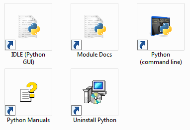
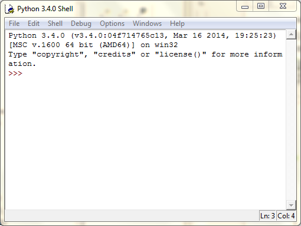

Quando si vuole imparare a programmare è bene che le prove e le
correzioni degli errori vengano fatte in modo da non dover bloccare il
computer o i programmi che si stanno adoperando.

Per fare questo, quando si lavora, si preferisce utilizzare un programma
speciale chiamato sistema di sviluppo (a volte chiamato anche IDE,
dall'inglese Integrated Development Environment) che permette di
scrivere tutte le istruzioni che si vuole e di correggerle se si scopre
di aver fatto degli errori (come succede spesso\!)

Il sistema di sviluppo quando si usa Python di chiama semplicemente IDLE
e si carica cliccando sull'icona IDLE (Python GUI) oppure dalla voce del
menu principale dei programmi

Una volta che IDLE verrà caricato correttamente sullo schermo apparirà
la finestra del programma molto simile, se non uguale, a questa:

Vediamo di studiare la finestra IDLE :

1.  In alto è presente la barra del menu da dove si selezionano le
    opzioni per caricare i programmi Python oppure salvarne dei nuovi

<!-- end list -->

1.  Le scritte presenti nella finestra mostrano la versione di Python
    (in questo caso è la numero 3.4 ma potrebbe essere diversa da quella
    che vedi sul tuo monitor in questo momento)

<!-- end list -->

1.  Il simbolo **\>\>\>** è chiamato **prompt** ed è un simbolo molto
    importante, perché serve per sapere se Python è pronto a ricevere i
    comandi. Se non ci fosse vorrebbe dire che in questo momento Python
    sta pensando ad altro, occupato a svolgere altre operazioni. Una
    volta che avrà finito di svolgere i suoi compiti, ci avviserà
    mostrando a video proprio il simbolo di \>\>\>

Negli esercizi è presente sempre il simbolo di prompt \>\>\> che però
non va mai scritto insieme al comando, ma serve solo per avvisare che il
comando che segue deve essere digitato solo se sul video è presente il
simbolo di prompt
