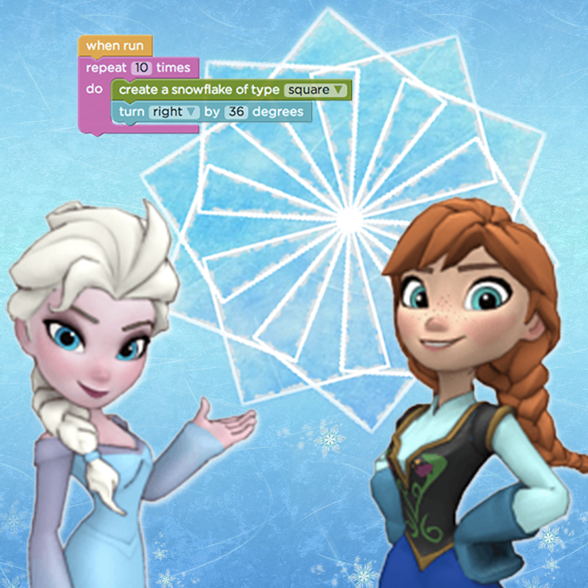

## Summary

 While we have always encouraged girls to participate in
CoderDojo and in STEM more broadly, in March 2017 we launched the
[CoderDojo Girls
Initiative](https://coderdojo.com/news/2017/03/01/how-you-can-support-the-coderdojo-girls-initiative/)
to take targeted steps to support girls in CoderDojo. **Our aim is to
increase the global % of girls attending Dojos from 29% to at least 40%
over the next three years.** Many Dojos are already taking measures to
reach more young girls, we want to work with them to inspire more Dojos
to join the movement to reach gender parity\! This will only be achieved
if everyone in the community and wider ecosystem works together to make
it a priority.

**Why start this initiative?**

We want to help make the tech sector more inclusive and as diverse as
the world we live in. Currently, 29% of young people in CoderDojo are
girls and 29% of volunteers in CoderDojo are female. By supporting girls
in Dojos we are helping empower girls to be tech creators. We believe
all girls deserve to have to space and support to enable them the same
opportunities as boys in our increasingly technological world. We don’t
know what the world is going look like in 10 years time, but we know it
will be powered by code\!

**Share you insights on our Forums** If you have any ideas, experiences
or insights that you think could benefit other CoderDojo community
members to learn and think about please post in our [CoderDojo Girls
Forum Category
here](https://forums.coderdojo.com/category/10/coderdojo-girls). You can
also share any inspirational stories of CoderDojo Girls or volunteers
from your Dojo\! 

## Content

### Getting Girls Coding\!

It is widely accepted that there is currently a dramatic disproportion
of women to men choosing to follow careers in computer science. “Since
1984, the number of computer science degrees awarded to women has
steadily declined, and today only 13 percent of computer science
graduates are female. Accordingly, top jobs in the field are
male-dominated.” - The NY Times. Encouraging more young women to engage
with technology is a core goal of CoderDojo.

## Guide for Parents & Guardians

[Girl-Guide-for-Parents.pdf](../files/Girl-Guide-for-Parents.pdf)

## Guide for CoderDojo Ninjas

[Girl-Guide-for-Ninjas.pdf](../files/Girl-Guide-for-Ninjas.pdf)

## CoderDojo Guide to Getting Girls Coding\!

<pdf width="900" height="1000">CoderDojo\_Girls\_Guide.pdf</pdf>

### Learn to Code with Frozen\!

 Here's a
cool tool for introducing young women and girls to coding. It's
Code.org's Frozen, Hour of Code game\! You can learn to code with Frozen
by clicking on the picture\!

### Google's Made with Code

Google's Made with Code platform offers reseources and projects aimed to
engage women in conmputer science. Their website also has a heap of
content form inspiring female mentors all around the world\!

[Made w/ Code (Google) - Maker and Code
Projects](http://www.madewithcode.com/)

### Other Groups and Organisations Supporting Girls Coding

| Topic | Full Title /Link                                                         | Level    | Language | Type              | Category |
| ----- | ------------------------------------------------------------------------ | -------- | -------- | ----------------- | -------- |
| Girls | [Girls Who Code](http://girlswhocode.com/)                               | Beginner | English  | External Resource | Tutorial |
| Girls | [Black Girls Code](http://www.blackgirlscode.com/)                       | Beginner | English  | External Resource | Tutorial |
| Girls | [Girls Teaching Girls to Code](http://www.girlsteachinggirlstocode.org/) | Beginner | English  | External Resource | Tutorial |
| Girls | [CodeFirst: Girls](http://www.codefirstgirls.org.uk/)                    | Beginner | English  | External Resource | Tutorial |
| Girls | [DCU Girls Dojo Git](https://github.com/CoderDojoDCU/CoderDojoGirls)     | Beginner | English  | Dojo Created      | Tutorial |
|       |                                                                          |          |          |                   |          |
