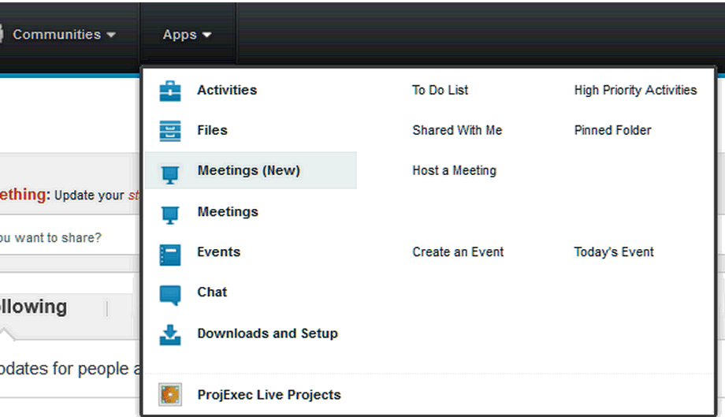
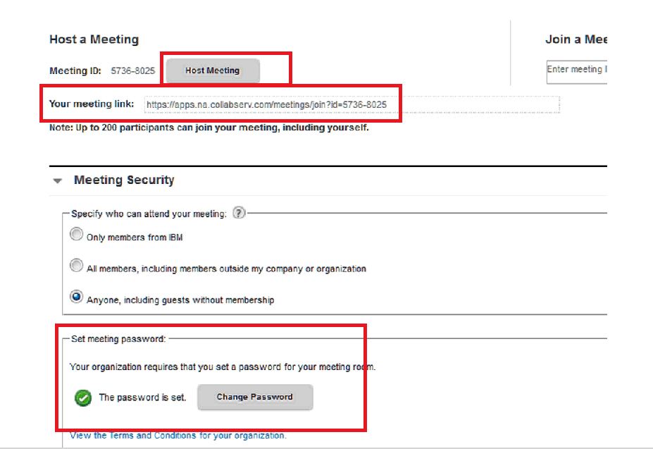

As you may know there is a global shortage of Mentors available to
volunteer at their local Dojos. Together the CoderDojo Foundation and
IBMers are providing a solution to bring the inspiring CoderDojo
experience to locations where there is a shortage of Mentors with:

# Remote Mentoring by IBMers\!

**High level overview of Remote Mentoring process:** To facilitate
secure and reliable remote mentoring sessions IBM SmartCloud SameTime
Meetings cloud software is used. Champion is given a licence for the IBM
ST Meetings software and is able to host online meeting where
IBMers-remote-mentors login using their own IBM licenses and all Ninjas
that are present at the Coderdojo locally with Champion - login as a
guests. Remote mentors and Ninjas collaborate using chat and screen
share functionalities of IBM ST Meetings. Champion is recording and
retaining records of each session for child protection reasons.

To enable collaboration between Champions and Remote mentors, IBM
collaboration tools are used: namely CoderDojo@IBM community, where
champions mainly work with Activity and Event applications. And below
you will find more detailed information about this process.

## Intro and Sign Up links for Mentors and Champions

IBMers want to facilitate Remote Mentoring to Dojos that can’t source
enough Mentors in their area. IBMers (enthusiastic people who work at
IBM) are offering support for Remote Mentoring sessions in the aim to
help new Dojos start in regions that don’t have the resources. With
Remote Mentoring Dojos can be mentored by IBMers thousands of miles
away, utilizing secure and reliable online collaboration tools kindly
provided by IBM. In Summer 2014, IBMers from all over the world have
connected with number of Dojos world-wide by piloting remote Mentoring
sessions using IBM SmartCloud SameTime Meetings. From this pilot IBMers
have developed simple instructions for everyone involved in the remote
Mentoring model by defining a process to connect remote Mentors with
CoderDojo Champions across the world - This is detailed in the sections
below.

  - **[Info on Remote Mentoring at CoderDojo for
    IBMers](Info_on_Remote_Mentoring_at_CoderDojo_for_IBMers.md)**

**Currently only IBMers can sign up as remote mentors**. But CoderDojo
Champions can sign up their Dojo to avail of these IBMer Remote Mentors
for their Dojo.

**CoderDojo Champions, Sign up your Dojo for Remote Mentoring below:**

:\*If your Dojo is not signed up for Remote Mentoring with IBMers you
can sign up your Dojo
[here](https://docs.google.com/a/hwf.io/forms/d/1rRH2mmyXNKRddkFRyIryY8vum0QYNN6sWII9dw3BpCQ/viewform).

**We need your help\!**

  -   
    We are looking for Dojos and CoderDojo Mentors get involved in
    remote Mentoring sessions. Not only will you have the opportunity to
    try this remote Mentoring solution first hand, you will also be
    helping CoderDojo to progress to the next stage in providing IT
    education to young people worldwide\! If your Dojo / Mentors would
    like to be a part of this awesome initiative to bring CoderDojo to
    remote locations, then let us know by filling out the form below.

<!-- end list -->

  - 
    
      -   
        **[Take part in Coderdojo Remote
        Mentoring\!\!](https://docs.google.com/a/hwf.io/forms/d/1rRH2mmyXNKRddkFRyIryY8vum0QYNN6sWII9dw3BpCQ/viewform)**

<!-- end list -->

  -   
    Remote Mentoring is a game changer that can help to provide IT
    education to the world-wide locations where otherwise it wouldn’t be
    possible – if you know about a CoderDojo that cannot take off due to
    the lack of Mentors, please send their contact details via form
    above, in comments section, while entering N/A in internet speed
    field.

## Sourcing and Connecting with Remote Mentors using CoderDojo@IBM Community (cloud based software)

CoderDojo Champions can setup details about their next available Dojo
sessions and connect with IBMer Remote Mentors using CoderDojo@IBM
community. Community is one of collaboration tools that is used to
manage interactions between Champions and Mentors. To use collaboration
tools you need to get a software license - this license is assigned to
you by Coderdojo Foundation team. Once you signed your Dojo up for
remote mentoring and team had verified your Dojo and clarified your
current circumstances, Zory (twitter: @ZoryTischenko) adds you to the
CoderDojo@IBM community, that you will be able to access at the link
[here](https://apps.na.collabserv.com/communities/service/html/communityoverview?communityUuid=2d0f6bb4-8ab8-42db-a083-7ba5aa6c51ba)

### Using CoderDojo@IBM Community

  - **CoderDojo Champions can**:

:\*Set up a profile for their Dojo detailing the next available sessions
so available IBMers can select to join and Remote Mentor at these
sessions.

:\*Add useful info to your Dojos profile for example: the time zone and
native language used at that Dojo.

:\*Contact IBMer Remote Mentors about up coming Dojo sessions and
discuss topics such as lesson content and other relevant session
information.

  - **IBMer Remote Mentors can**:

:\*Search for Dojos that need mentors - Events sections to sign up for
upcoming remote mentoring sessions in different Dojos, use Activity
section to find more information about specific Dojo.

:\*Book in for an upcoming CoderDojo event, make sure to book it into
your dairy, because, when time comes, there will be at least 30 young
people hoping that an IBMer will connect with them.

:\*Don't worry - they won't all ask you questions, however, the fact
that IBMer will be joining the session alone generates good amount of
excitement in the group.

### During the live Remote Mentoring session

Coderdojo Champions should:

  - Have the [set of instructions for SameTime
    meetings](Remote_Mentoring_Instructions_on_how_to_use_SameTime_Meetings.md)
    available.
  - Make sure the session is recorded (this is for child protection
    purposes), keep it positive and be patient with all attendees in the
    meeting room. No matter how slow anything happens, once you are
    pushing it forward, there is progress taking place, and that is what
    important.
  - Once logged out from a Remote Mentoring session - spread the word\!
    Tweet mentioning [@CoderDojo](https://twitter.com/CoderDojo), along
    with the Twitter handle of the CoderDojo that you just took part in,
    hashtag it with
    [\#powerfulplay](https://coderdojo.com/powerfulplay/),
    \#remotementoring. If you can, write blog entry about your
    experience and share it with your social networks - make sure to let
    the Coderdojo Champion know where the entry is and request any
    permissions needed from them, so they can help spread the word.

Lead by example, so more IT professionals world-wide can join the
CoderDojo movement in enabling free IT education for young people around
the
world\!\!

### Tips For CoderDojo Champions using CoderDojo@IBM Community (cloud based software)

  - **Create a dedicated activity for your Dojo**

:\*Add information about your Dojo for example: create a dedicated Dojo
Activity like "HTML - Website Tutorial". You can do this using the
"Activity app" located on left hand side navigation bar

:\*Add any other information that you like. During this activity you can
connect with your mentors and parents for details that should be added
such as session topics that you would like mentors to cover etc.

:\*Try not to upload to many Files, as this community has 5Gb space
limitation. If you need to share some files use links to files stored on
other websites - for example, Google Docs for documents, Flicker or
Facebook for pictures, youtube for videos, etc.

:\*To host online meeting to provide a place where CoderDojo youth and
remote mentors can collaborate, you need to ask for a licence /
credentials for IBM Engage collaboration software. CoderDojo Foundation
team will provide you with the licence (you only need one).

:\*Create 4-8 Events for next sessions (use "Events app" this can be
accessed on left hand side navigation bar) within the CoderDojo@IBM
community. In the Event description put what technologies you will
explore during the Dojo session, how many attendees you hope to have,
what technologies you need Remote Mentors for, link to your online room,
time and duration of the session, etc. IBMer Remote Mentors will use
Events that you set up to sign up for a specific session, booking a
day\&time in their calendars. Allow 1-2 weeks for mentors to sign up,
e.g. post your events way up front. Aim to have 2-3 remote mentors on
the session - providing that they will be with you for entire duration
of the session, this number is sufficient to keep your Ninjas engaged.

:\*Prior to the session - familiarise yourself with the instructions for
online meeting tool (you can find info on this
[here](Remote_Mentoring_Instructions_on_how_to_use_SameTime_Meetings.md)).
Add info for EACH role (e.g. host, champion, remote mentor, pupil) to
your online meeting room, print couple of versions for attendees to pass
around and read.

  - **On the day**

:\*Start the online session (e.g. host online meeting as per
[instructions](Remote_Mentoring_Instructions_on_how_to_use_SameTime_Meetings.md)).
Do this 15-20min before your local session takes place to give time for
any technical issues.

:\*Connect with your IBMer Remote Mentor and discuss any queries they
may have.

:\***Press the record button**\! Once the online session is started you
will need to record each session for the child protection purposes.
**You will need to keep an archive of ALL the online meetings**.

:\*Away you go\!

:\*Post Remote Mentoring session: Tweet - mentioning @CoderDojo, along
with the Twitter handle of the CoderDojo that you just mentored, hashtag
it with [\#powerfulplay](https://coderdojo.com/powerfulplay/),
\#remotementoring. If you can, write blog entry about your visit and
share it with your social networks - make sure to let the Coderdojo
Champion know where the entry is and request any permissions needed from
them, so s/he can help spread the word. Your contribution in spreading
word about remote mentoring is very important - it will help make remote
mentoring a part of normal day to day life for every IT professional,
and hence provide free IT education to young people world-wide.

Dojos can Register their interest for Remote Mentoring
[here](https://docs.google.com/a/hwf.io/forms/d/1rRH2mmyXNKRddkFRyIryY8vum0QYNN6sWII9dw3BpCQ/viewform)

Watch the first Remote Mentoring kick off call
[here](https://www.youtube.com/watch?v=q0sAI74OC0o). It walks you
through the creating Activity, Events, explains how to use tools
involved. Connect with @ZoryTischenko on twitter - Zory is a focal point
/ driving this initiative on IBMers side.

# Remote Mentoring using SameTime Meetings (software)

Once a Coderdojo Champion has organised an agreed session with an IBMer
Remote Mentor via the Greenhouse Community the Remote mentoring sessions
will take place using SameTime Meetings software.

### Accessing Meeting Rooms

Here is info on accessing a meeting room link (This is the same for
every person who has been given a license):

Champions that have been verified will be given and IBM Engage licence
and will automatically given a meeting room (it holds maximum 200
people). Meetings are hold as collaboration over chat and screen-share
(no audio or video is enabled at this time).

You will have to access the meeting using a browser.

  - **Here's how Champions finds link to their very own online meeting
    room:**

:\*Go to the page at <https://apps.na.collabserv.com> and log in using
your ID & password (This would be the license details you've recieved -
e.g. email address and password)

:\*This will bring you to your Connections home page. Click on the
"Apps" drop down menu on the top of the page and click on "Meetings
(new)". See image below:

:\*This will bring you to your meetings home page. You will have to set
up a password. Please use something you will remember.

:\*Your meeting URL is on this page too - you will share this URL with
Ninjas and remote mentors to enable them to connect in your meeting
room.

:\*To start your meeting room, click on "Host Meeting" and you'll be
asked for your password and then you'll enter your room.

:\* Step-by-step instructions for everyone involved explaining how to
use Same Time Meetings:
[here](Remote_Mentoring_Instructions_on_how_to_use_SameTime_Meetings.md).

## For CoderDojo Members taking part in remote Dojos

  - The Champion will hold one license to authenticate him/her, each
    Champion will request this licence and be verified by the CoderDojo
    Foundation team. You can contact CoderDojo Foundation
    [here](https://coderdojo.com/contact/).
  - CoderDojo Champions / Mentors will login using their license to host
    the meeting using SameTime Meetings software.
  - Coderdojo youth attendees will login 'as a guest' to online meeting
    room.
  - All children must be physically at one location with a CoderDojo
    Champion / Mentor (and their parent/s) for the entire duration of
    the CoderDojo session so it is Champion's responsibility to
    authenticate young people presents that are in online meeting room.

<!-- end list -->

  - ***When working with young people it is important to make sure that
    all online interactions are secure, that each individual in the room
    is authenticated and that all remote sessions are recorded. All
    IBMers will already have a SameTime Meetings software licence and
    they authenticate as they normally do at IBM as IBM employees***.

# Becoming a Remote Mentor at CoderDojo

This section will tell you more about how you can play your part in
enabling free IT education for young people world-wide, as a remote
mentor. Please note that Remote Mentoring is a new initiative, and it
still in 'prove of concept' mode. Due to this, we have limited number of
licenses for the software right now. Hence we try to use these licenses
for Champions only, so to be able to facilitate more Dojos. Hence we try
to have only IBMers in the mentor role (this is only due to the fact
that IBMers already have license for the IBM software that is used,
since they work at IBM). Once we had used up all the licenses we have,
we will build up a waiting list for both, Champions and Mentors, and
will look into getting more licenses to facilitate remote mentoring for
Dojos and bring on board mentors on the waiting list.

On this page you can find more about concept of mentoring at CoderDojo.
If you would like to be added to the list of non-IBMer mentors please
sign up as a mentor
[here](https://docs.google.com/forms/d/1rRH2mmyXNKRddkFRyIryY8vum0QYNN6sWII9dw3BpCQ/viewform)
- we will contact you once we start brining on board non-IBMer mentors
too.

## Mentoring Tips - Remotely or Locally

  - CoderDojo focuses on peer-to-peer and self lead learning and in an
    informal and social education environment. It is very different from
    formal education structures, there is no curriculum, no expectations
    and no grades. Mentors are there to inspire and empower young people
    to develop their problem solving skills and learn to find answers
    for themselves.

<!-- end list -->

  - A Mentor is not expected to have all the answers and in some cases
    Mentors end up mentoring young people in technologies that are just
    as new to them as they are to the pupil. At a Dojo a Mentor is there
    to help CoderDojo youth to build their problem solving skills and to
    show appreciation of the young persons progress empowering them with
    the drive to learn. This kind of environment encourages young
    peoples curiosity and creativity with technology at their Dojo.

<!-- end list -->

  - If you are worried that your technical skills are not enough to
    Mentor a young person - don't. Sometimes it is even better not to
    have all the answers, in this case you can help young people to find
    these answers on their own. This can be more beneficial for young
    people learning, than giving them the answer removing the process of
    questioning, searching and evaluating new information.

<!-- end list -->

  - When asked a question you do not know answer for - admit it, and
    suggest to find answer together. Then Mentor them via the process of
    finding the answer online for themselves.

<!-- end list -->

  - You can explain that there is not much point to learning all
    language syntaxes by heart - they are always available online,
    besides, all IT knowledge is evolving all the time, and today
    popular technologies are quickly replaced by others. Hence, once you
    practice enough how to problem solve, and once you gain confidence
    in taking on board new, unfamiliar to you technology - you will be
    capable to program anything, using any language.

### Problem Solving

  - Problem solving is the truly valuable skill, you can mention this to
    young people every time you are unable to answer their question.
    When you know the answer to the question - do not give it away,
    instead try to help them find it by themselves. Explaining the
    importance of problem solving as a skill. If they spent a good
    amount of time searching and did not find it - at least they
    practised a problem solving exercise\! In this case then give them
    an answer rewarding their hard work and patience.

### Role Models

  - Young people are great at figuring out problems for themselves and
    if your Dojo has Mentors that are regarded as role models, Mentors
    who spend time to time asking youth attendees what they're up to and
    who positively reinforce their efforts – you will see amazing
    creativity and progress in the knowledge and skill of the young
    people attending your Dojo\! This is displayed annually at the
    [Coolest Projects Event.](http://coolestprojects.org/)

<!-- end list -->

  - As for questions from kids - many times they will be repetitive, and
    you need to remember that CoderDojo heavily encourages peer
    learning, hence once you explain one child how to do something, you
    should forward all other kids with the same question to this child.
    It will generate a lot of positive collaboration among the kids
    locally and help them make friends, build their social and
    team-collaboration skills.

### Sugata Mitra on Remote Mentoring and Child-driven education

  - Sugata Mitra had tested this technique within child-driven learning
    environment in India - by mounting a PC into the wall (literally)
    and allowing young people using it freely, while Remote Mentors were
    interacting with young people to help them out on their learning
    journey. This is a 'how to' and 'why to' intro for every person who
    wants to be successful Remote Mentor, it is also an awesome talk, so
    check it out below:

<!-- end list -->

  - Watch [Sugata Mitra TED talk about Remote
    Mentoring](http://www.ted.com/talks/sugata_mitra_build_a_school_in_the_cloud?language=en).

# Process overview for Champions

  - **Register your Dojo** on [the CoderDojo listing
    site](https://zen.coderdojo.com/) if you haven't done so yet. **You
    must register your Dojo in order to participate in Remote
    Mentoring**. You can register your Dojo as soon as you have venue
    for your sessions.

Sign up for remote mentoring
[here](https://docs.google.com/forms/d/1rRH2mmyXNKRddkFRyIryY8vum0QYNN6sWII9dw3BpCQ/viewform)
- Zory (twitter: @ZoryTischenko) will get in touch with you to get you
on board with CoderDojo@IBM Community.

## Logged in to the CoderDojo@IBM community

  - Once logged into the CoderDojo@IBM community, Champions will have to
    set up details about their Dojo, so IBMer Remote Mentors can see if
    they have the ability to help your Dojo by Remote Mentoring. After
    specifying details for their Dojo in dedicated Activity, Champion
    will set up Events for upcoming CoderDojo sessions and
    IBMers-remote-mentors will use those Events to sign up for specific
    session. Hence, bookings for mentors will be managed using Events
    functionality of CoderDojo@IBM community.
  - To host online meeting and thus to provide a place where CoderDojo
    youth and remote mentors can collaborate, champion will host an
    online meeting, using IBM SmartCloud SameTime Meetings software,
    which is part of collaboration offering that each champion will have
    a license for.

## Remote Mentoring session

  - Start the online session (e.g. host online meeting as per
    instructions for Host
    [here](Remote_Mentoring_Instructions_on_how_to_use_SameTime_Meetings.md)).
    Do this 15-20min before your local session takes place to give time
    for any technical issues.
  - **Press the record button**\! Once the online session is started you
    will need to record each session for the child protection purposes.
    **You will need to keep an archive of ALL the online meetings**.

## Share your Experience

Tweet - mentioning @CoderDojo, along with the Twitter handle of the
CoderDojo that you just mentored, hashtag it with
[\#powerfulplay](https://coderdojo.com/powerfulplay/),
\#remotementoring. If you can, write blog entry about your visit and
share it with your social networks - make sure to let the Coderdojo
Champion know where the entry is and request any permissions needed from
them, so s/he can help spread the word. Your contribution in spreading
word about remote mentoring is very important - it will help make remote
mentoring a part of normal day to day life for every IT professional,
and hence provide free IT education to young people world-wide.

Dojos can Register their interest for Remote Mentoring
[here](https://docs.google.com/a/hwf.io/forms/d/1rRH2mmyXNKRddkFRyIryY8vum0QYNN6sWII9dw3BpCQ/viewform)
