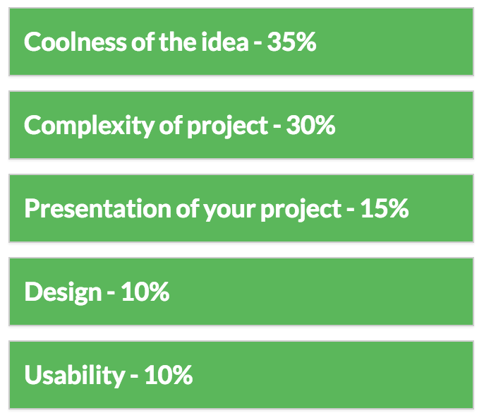

**Inspired by Creativity**

The [CoderDojo Coolest Projects](http://coolestprojects.org) aims to
encourage, celebrate and showcase creativity among members of the
CoderDojo community. This event is all about the members and is a
celebration of what they have achieved and created in their local Dojo.
The event gives CoderDojo members the chance to show the community what
they've been developing by \[<http://coolestprojects.org/#register>|
registering\] their coolest projects for the event.

At CoderDojo we're all about cool and encouraging young people to
showoff their cool ideas. So first and most importantly CoderDojo
students will receive a special CoderDojo Coolest Project Belt for
presenting their project at the event. This belt is recognition for
everything they've learned and achieved in their CoderDojo during the
past year.

This event is all about the participants and we have a great day of
celebration lined up. In addition to inspirational talks by industry
leaders, the event includes several workshops on relative tech topics
such as how to build your own apps and more.

**Rewarding skill**

Every level is welcome and rewarded\! Projects will be ranked for not
only the complexity and usability of the project but also using a 'cool'
factor assessment criteria, similar to the one rule of CoderDojo: “be
cool\!”. Projects across seven categories are invited:

  - Scratch

<!-- end list -->

  - Websites

<!-- end list -->

  - Apps

<!-- end list -->

  - HTML Games

<!-- end list -->

  - Advanced Languages

<!-- end list -->

  - Enterprise

<!-- end list -->

  - Other

Every project that is presented is cool, we're also looking to find the
Coolest Project in each category. The projects will be judged on the
following criteria:

So its now your turn to come up with an idea you are passionate about
and want to develop.

## Coolest Projects 2014

CoderDojo Ninjas from Dojos across Ireland and Europe came in their
droves to DCU on the 7th and 8th of June to demo their cool and
imaginative projects that they've been working on at their Dojos at the
CoderDojo Coolest Projects awards. The Coolest Projects awards is all
about encouraging CoderDojo participants, every attendee was awarded a
super cool CoderDojo USB Belt for entering their projects\! Prizes were
also awarded to projects like a rebuilt Robot, an eCar charger locator
app, and game for dyslexic young people, a camera selfie site and
more\!\! Read all about it
**[here](https://coderdojo.com/news/2014/06/09/young-coding-ninjas-have-the-cool-factor/)**.

### 2014 Winners

**Websites Category**

  - Overall winner: Ina Panayotova, Pulse of the People - interactive
    data visualization, CoderDojo Cork

:\*Farm Recorder - Ciaran Flanagan, Claremorris CoderDojo

:\*Marshmallow - Maciej Goszczycki, CoderDojo Science Gallery

:\*The Kids Studio - Lauren Boyle, CoderDojo Bray

**App Category**

  - Overall Winner: ReCharge my eCar - Niamh Scanlon, DCU

:\*Fix my Pothole App - John Ryan, Thurles CoderDojo

:\*Classroom Auction App - Ciara Hogan, CoderDojo Girls DCU

:\*Punchbag IT - Jeremy Rigney, Athlone CoderDojo

**Other Category**

  - Overall Winner: Camera Selfies - Harvey, CoderDojo Science Gallery

:\*Ardalet - Ciadhla Mulloy, CoderDojo Bray

:\*Project 126 - Albert, Karol and Kamil, Zambrów CoderDojo (Poland)

:\*Galileo Robot - Thomas Carrigan, DCU CoderDojo

**Mix Category (HTML Games, Enterprise, & Advanced Languages)**

  - Overall Winner: Web Based Responsive Design - Adam Barry, Malahide
    CoderDojo

:\*Alexis Ordinary Day by Team Pigasus - Luke Hamilton, Oisín Fitzgerald
& Conor Bastible, Sligo CoderDojo

:\*CheetahSpoke Store - Ben Herbert

:\*Clash of Empires - Adrian and Raul, Timisoara CoderDojo (Romania)

**Scratch Category**

  - Overall Winner: The Showdown Western Game - Gavin Chapman, Ashbourne
    CoderDojo

:\*Anti Bullying Quiz - Kathleen Maughan, Deansrath CoderDojo

:\*Dyslexic Games - Sam & Thomas Curran, Wilmslow Dojo (UK)

:\*Percy Jackson Quiz - Ronan Cassidy, Athlone CoderDojo

**Overall International Project**

  - Useless Box, a mechanically programmed box - Ugo Baroncini, Bologna
    CoderDojo (Italy)
