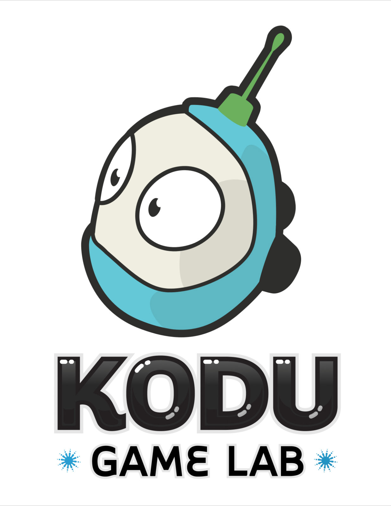

These Sushi cards have been created by Microsoft for the CoderDojo
community to help young people learn game programming with Kodu Game
Lab\!

Kodu lets kids create games on the PC and Xbox via a simple visual
programming language. Kodu can be used to teach creativity, problem
solving, storytelling, as well as programming. Anyone can use Kodu to
make a game, young children as well as adults with no design or
programming skills.

# Card 1 - I Need Kodu

[Card_1_-_I_need_Kodu.pdf](../files/Card_1_-_I_need_Kodu.pdf)

# Card 2 - Build a Main Character

[Card_2_-_Build_a_main_character.pdf](../files/Card_2_-_Build_a_main_character.pdf)

# Card 3 - Teach Kodu to Move

[Card_3_-_Teach_Kodu_to_move.pdf](../files/Card_3_-_Teach_Kodu_to_move.pdf)

# Card 4 - Make Kodu Shoot

[Card_4_-_Make_Kodu_shoot.pdf](../files/Card_4_-_Make_Kodu_shoot.pdf)

# Card 5 - Make Kodu Talk

[Card_5_-_Make_Kodu_talk.pdf](../files/Card_5_-_Make_Kodu_talk.pdf)
