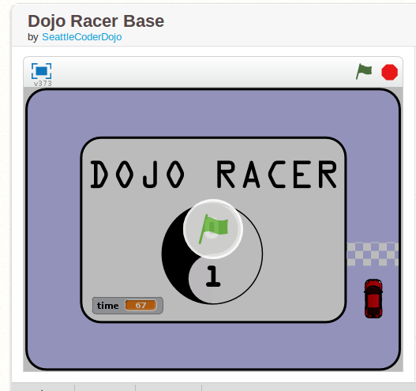

## Summary

 [Ninjas](Ninjas.md) create a racing game using
scratch. 

## Tips for use

You will need to either install Scratch on the
[Ninja](Ninja.md)'s machine or use the [web-based
editor](https://scratch.mit.edu/) in advance of using these cards.

A base project is provided with a background and sprites. Ninjas add
code blocks to turn it into a racing game.

Ninjas can either Remix the project in the online editor or download the
project and import it into Scratch on their machine.

## Content

### DojoRacer

Greg Bulmash, Champion of CoderDojo Seattle, created a little racing
game in Scratch.

[**Start with the base sprites and fill in the code
HERE**](http://scratch.mit.edu/projects/13387946/)
