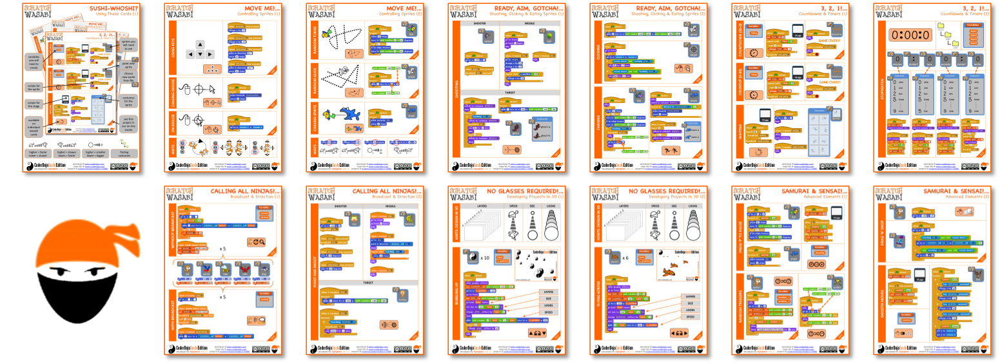

Scratch Sushi Cards from @ginglexia, two youth mentors from Wilmslow
CoderDojo:

**A4 Cards**

There are also example Scratch project files for each of the individual
items on our cards in our Scratch on-line studio ....
<https://scratch.mit.edu/studios/1170890/>

All these PDF files and example projects are also available on our
Github repository - <https://github.com/ginglexia/eucodeweek-wasabi>
