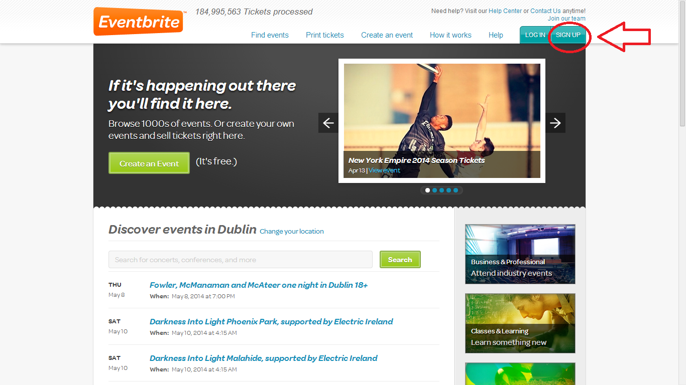
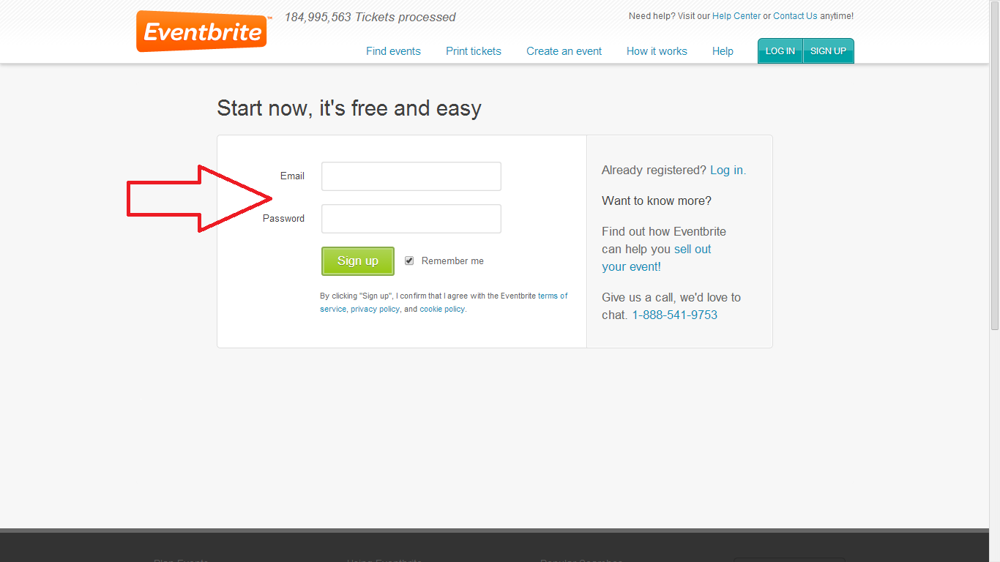
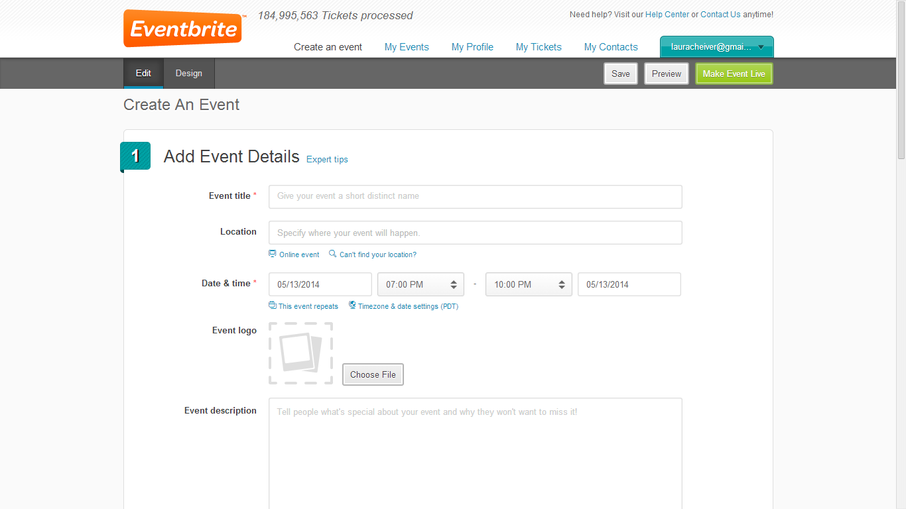
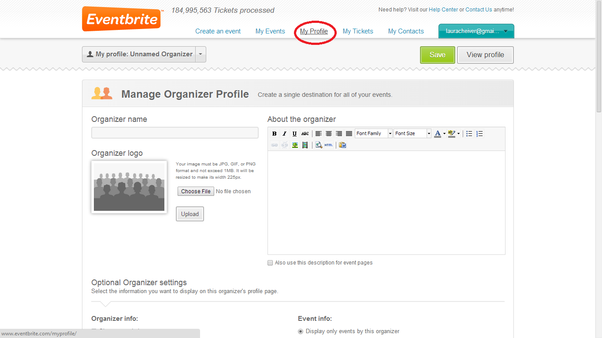

## Set up an Eventbrite Account

Eventbrite is a free service that offers everything you need to sell
tickets and manage registration for any kind of event and Dojo Champions
around the world use it to manage their registration and attendance for
Dojo sessions.

To set up an account with Eventbrite you can go to
<http://www.eventbrite.com/>

  - Select "Sign up" from the top right menu.

  - Fill in your details in the fields provided.

  - You are then given the option of creating an event straight away.

  - From here, using the navigation bar, you can also access your
    Eventbrite Profile. Here you can enter your Dojo name and details.

  - Once you have created an event you will then be able to list the
    event ID on your Dojo's [Zen](Zen.md) page. You can then
    create a new event and release tickets for every Dojo session you
    run and update this on your [Zen](Zen.md) listing.
