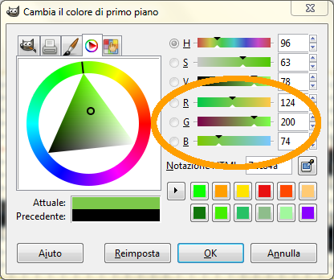

Un'altra cosa molto importante, in un videogioco, sono i colori.

Nei computer moderni i colori superano i 16 milioni di tonalità diverse,
per cui si è dovuto pensare ad un sistema per poterli gestire tutti.

Il sistema scelto più diffuso e utilizzato anche dai comandi della
libreria Pygame è quello di usare tre numeri

    (R, G, B)

che rappresentano le porzioni di **rosso** (red), **verde** (green) e
**blu** (blue) utilizzati per creare il colore.

Ad esempio il colore **Aqua** è rappresentato dalla terna

    (0,255,255)

il **bianco** da

    (255,255,255)

mentre il **nero** da

    (0,0,0)

Se si vuole inventare un nuovo colore basta scegliere un numero compreso
fra 0 e 255 e creare una nuova combinazione. Ad esempio, che colore sarà
il seguente?

    (124, 200, 74)

Un modo molto semplice per conoscere la combinazione dei tre numeri
necessari per comporre un colore è quello di utilizzare il programma
open-source [Gimp](http://www.gimp.org) il quale presenta questo
pannello dedicato ai colori da dove è possibile leggere o impostare i
valori desiderati:

  - Se il colore è già impostato i tre valori saranno visualizzati negli
    spazi indicati
  - Se invece si desidera conoscere quale colore è formato da una
    particolare combinazione, basta inserire i valori R,G,B sempre negli
    spazi indicati e osservare il risultato.
