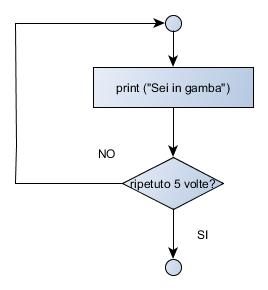

Fino ad ora abbiamo scritto una serie di comandi Python di una sola riga
e abbiamo studiato il risultato di questi comandi.

Python, però, prevede anche dei comandi più lunghi che vanno scritti
usando più righe.

Questi comandi (che spesso vengono anche chiamati costrutti) sono molto
importanti perché ci permettono di prendere delle decisioni in modo che
il nostro programma possa eseguire un comando solo se si verifica una
particolare condizione (ad esempio: visualizzo il messaggio “HAI
INDOVINATO” se viene inserita la risposta esatta, altrimenti si dovrà
visualizzare il messaggio “PECCATO, HAI SBAGLIATO RISPOSTA”)

I costrutti fondamentali sono tre e uno di questi lo abbiamo già
incontrato così alla fine ne rimangono solo due da imparare.

Vediamoli tutti.

# Sequenza

  - La sequenza è formata dai comandi scritti uno dopo l'altro.
  - Questi comandi vengono sempre eseguiti nello stesso ordine con cui
    sono stati scritti. Ad esempio:

`numero = int(input(“Inserire un numero”)`  
`print (“Il quadrato del numero inserito è “,numero*numero)`

In questo esempio le due istruzioni verranno sempre eseguite sempre in
sequenza (prima scrivendo il numero e poi calcolando il quadrato).

# Selezione

  - Le istruzioni di una selezione vengono eseguite solo se si verifica
    una particolare condizione.

<!-- end list -->

  - In questo costrutto esistono due blocchi di istruzioni che si
    escludono a vicenda (o viene eseguito il primo blocco oppure il
    secondo, mai tutti e due)

  - Per decidere quale dei due blocchi va eseguito è sempre presente una
    condizione introdotta dal comando if e chiusa dal carattere “:”

<!-- end list -->

  - Se la condizione risulterà vera (cioè il numero inserito è più
    grande di 100) allora verranno eseguite le istruzioni comprese fra
    la condizione **if** e la condizione **else**

<!-- end list -->

  - Se la condizione risulterà falsa (cioè il numero inserito è invece
    più piccolo o uguale a 100) allora verranno eseguite solo le
    istruzioni comprese fra la condizione **else** e la fine della
    selezione

Questo nuovo costrutto introduce quindi un doppio comportamento del
nostro programma, come se il nostro programma fosse in grado di prendere
delle decisioni e rispondere ai controlli previsti.

Ad esempio, inserendo due numeri diversi il programma potrebbe
rispondere in due modi diversi, come nel seguente esempio:

Come si può notare il messaggio visualizzato cambia a seconda del numero
inserito.

  - Il costrutto di selezione è molto importante perché permette al
    nostro programma di prendere delle decisioni e di eseguire dei
    comandi solo se si verificano determinate condizioni.

<!-- end list -->

  - Toccherà a noi capire quante condizioni sarà necessario controllare
    e utilizzare un numero corretto di selezioni

# Ripetizione

L'ultimo costrutto fondamentale è la ripetizione: spesso è utile
ripetere un blocco di istruzioni,che possono essere sia delle sequenze
che delle selezioni.

  - La ripetizione è composta da un numero di comandi da svolgere e da
    una condizione che controlla quante volte i comandi devono essere
    ripetuti

<!-- end list -->

  - Ad esempio in un videogioco i comandi necessari per farlo funzionare
    devono essere eseguiti sempre, a meno che il giocatore o la
    giocatrice decidano di spegnerlo; in questo caso la condizione di
    ripetizione è infinita.

