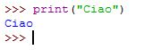
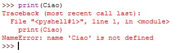
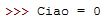
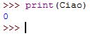

Proviamo a scrivere i primi comandi e vediamo di capire cosa
significano.

## Esercizio n.1

  - Scrivere il seguente comando e osservare come risponde Python

  - Adesso proviamo a scrivere lo stesso comando senza scrivere le
    virgolette

Questa volta Python risponde con un errore e ci dice che l'istruzione
`print(Ciao)` contiere il nome Ciao che risulta non essere definito.

Ora proviamo ad eseguire questo comando e utilizzare print per vedere
cosa Python stamperà a video:

e poi

## Alcune considerazioni

Cosa possiamo osservare studiando le risposte di Python? (Rispondere
VERO oppure FALSO)

1.  Python visualizza gli errori a caso
2.  L'uso delle virgolette permette a Python di capire quando deve
    visualizzare un messaggio esattamente come l'ha scritto il
    programmatore o la programmatrice
3.  Se non si usano le virgolette Python cerca se il messaggio
    corrisponde ad un nome che è già stato definito
4.  Python usa il simbolo **=** per inserire un numero all'interno della
    memoria del computer

## Esercizio n.2

Ora vediamo come Python è in grado di svolgere alcune operazioni come se
fosse una vera (e più potente\!) calcolatrice.

Per svolgere l'esercizio occorre:

1.  inserire il comando proposto
2.  osservare il risultato che Python visualizzerà
3.  leggere la nota relativa al comando

Riportare il risultato ottenuto dopo aver eseguito il comando indicato:

  - \>\>\> print(10+5) : In questo caso abbiamo scritto l'espressione
    fra parentesi e Python ha calcolato il risultato

<!-- end list -->

  - \>\>\> print (“10+5”): Python, questa volta, non ha riconosciuto il
    numero 10 e il numero 5, perché sono stati scritti fra virgolette e
    quindi ha visualizzato i numeri come se fossero un messaggio

<!-- end list -->

  - \>\>\> print(“Ciao”\*5): In questo esempio Python ha riconosciuto
    l'operazione di moltiplicazione fra un numero e un messaggio,
    visualizzando cinque volte il messaggio scritto fra le virgolette

<!-- end list -->

  - \>\>\> print(10+5\*5): Python ha calcolato il risultato
    dell'espressione seguendo la regola che prima vengono svolte le
    moltiplicazioni e le divisioni (se ci sono) e solo dopo le somme e
    le sottrazioni (se ci sono)

Se si volesse far calcolare a Python qualcosa di più difficile, sarebbe
necessario utilizzare una delle tante **funzioni di libreri** a già
predisposte.

Ad esempio, per dire a Python che desideriamo utilizzare una delle
funzioni di libreria, dobbiamo scrivere il comando che carica la
libreria e il nome della libreria desiderata (perché Python possiede
tante librerie diverse ognuna con il proprio nome):

`>>> import math;`

Con questo comando chiediamo a Python di caricare le funzioni della
libreria math, che è la libreria per tutte le funzioni matematiche più
comuni, compresa la radice quadrata che in inglese diventa sqrt (square
root):

`>>> print(math.sqrt(5))`  
`2.23606497749979`

Nell'esempio precedente si è prima scritto il nome della libreria
(math), seguita dal punto (.), seguito dal nome della funzione (sqrt) e
dalle parentesi tonde necessarie per contenere il valore di cui si vuole
calcolare la radice quadrata.

Un'altra funzione interessante è quella che serve per calcolare la
misura dell'ipotenusa di un triangolo rettangolo conoscendo le misure
degli altri due lati:

`>>> print(math.hypot(3,4))`  
`5.0`
