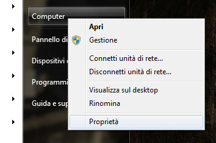
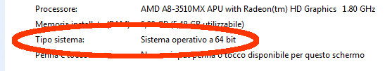

Per poter utilizzare in modo corretto il linguaggio di programmazione
Python e la libreria grafica Pygame basta seguire queste semplici
istruzioni.

## Quale sistema operativo stai utilizzando?

Fra i sistemi operativi che puoi utilizzare per far funzionare il tuo
computer sicuramente avrai a disposizione uno dei tre seguenti:

  - Windows XP oppure Vista oppure 7 oppure 8 oppure 8.1
  - Linux Fedora oppure Slackware, Debian, Mint, Ubuntu, OpenSuse, ecc
  - Apple MacOS

Per ognuno di questi operativi le operazioni sono leggermente diverse e
quindi per configurare correttamente Python dovrai seguire la sezione
dedicata al tuo sistema operativo.

## Windows 32bit oppure 64bit

Per scoprire se la tua versione di Windows è a 32bit oppure a 64bit devi
accedere al pulsante di Start, selezionare la voce Computer e premere il
pulsante delle proprietà (in genere il pulsante destro)

A questo punto nel pannello delle proprietà che verrà visualizzato sarà
chiaramente indicato se si tratta della versione 32bit oppure 64:

## Istallazione di Python 3.4 (l'ultima versione disponibile finora)

A seconda della propria versione di Windows scaricare SOLO una delle due
versioni:

  - [Windows 32bit:
    Python 3.4 32bit](https://www.python.org/ftp/python/3.4.0/python-3.4.0.msi)
  - [Windows 64bit:
    Python 3.4 64bit](https://www.python.org/ftp/python/3.4.0/python-3.4.0.amd64.msi)

Salva il programma e una volta terminato lo scaricamento segui le
semplici istruzioni (se non sei sicuro/sicura lascia che il programma di
istallazione imposti le opzioni più comuni e premi Invio oppure
Avanti)

## Istallazione della libreria Pygame 1.9.2 (l'ultima versione disponibile finora)

A seconda della propria versione di Windows scaricare **SOLO** una delle
due versioni:

1.  Vai al seguente indirizzo web: [Sito non ufficiale (ma consigliato)
    di Pygame](http://www.lfd.uci.edu/~gohlke/pythonlibs/#pygame)
2.  seleziona il file in base alla versione di Windows:

`   Windows 32bit: pygame‑1.9.2a0.win32‑py3.4.exe`  
`   Windows 64bit: pygame-1.9.2a0.win-amd64-py3.4.exe`

Anche in questo caso, salva il programma e una volta terminato lo
scaricamento segui le semplici istruzioni (se non sei sicuro/sicura
lascia che il programma di istallazione imposti le opzioni più comuni e
premi Invio oppure Avanti)
