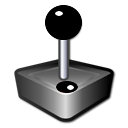
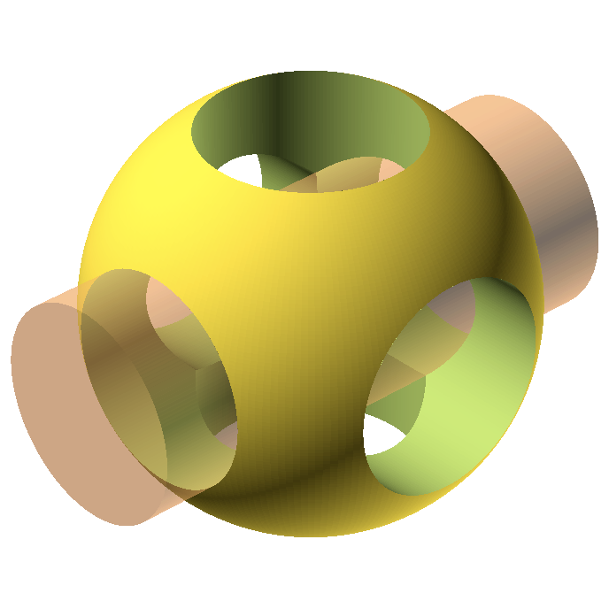

### Kata Dutch

### Welkom bij de Nederlandstalige versie van de Kata\!

[link=KataDutch|center | 600px](File:Katadutch.png‎.md)

Het materiaal op dit gedeelte zal voornamelijk voor de
[Nederlandse](http://coderdojo.nl) en
[Vlaamse](http://www.coderdojobelgium.be/) CoderDojo's gemaakt
worden.

### Sushi

[KataDutch:Sushi](KataDutch:Sushi.md)

  - 
    
      -   
        Sushi
Kaarten

  

### Scratch

 [KataDutch:Scratch](KataDutch:Scratch.md)

  - 
    
      -   
        Scratch

  

### HTML

[KataDutch:HTML](KataDutch:HTML.md)

  - 
    
      -   
        HTML

  

### Javascript

[KataDutch:Javascript](KataDutch:Javascript.md)

  - 
    
      -   
        Javascript

  

### Autodesk Tinkercad

 [Autodesk
Tinkercad](KataDutch:Autodesk_Tinkercad.md)

  - 
    
      -   
        Autodesk
Tinkercad

  

### Minecraft

[KataDutch:Minecraft](KataDutch_Minecraft.md)

  - 
    
      -   
        Minecraft

  

### Python

 [KataDutch:Python](KataDutch:Python.md)

  - 
    
      -   
        Python

  

### PHP

[KataDutch:PHP](KataDutch:PHP.md)

  - 
    
      -   
        PHP

  

### Lego Mindstorms

 [KataDutch:Lego
Mindstorms](KataDutch:Lego.md)

  - 
    
      -   
        Lego
Mindstroms

  

### Gamemaker

[KataDutch:Gamemaker](KataDutch:Gamemaker.md)

  - 
    
      -   
        Gamemaker

  

### Arduino

[Arduino](KataDutch:Arduino.md)

  - 
    
      -   
        Arduino is een open-source elektronica prototyping platform,
        gebaseerd op flexibele en makkelijk te gebruiken hardware en
        software (C++-achtig). Het is bedoeld voor kunstenaars,
        ontwerpers, hobbyisten, en iedereen die geïnteresseerd is in het
        maken van interactieve objecten of
omgevingen.

  

### MOBIEL

[Mobiel](KataDutch:Mobiel.md)

  - 
    
      -   
        Mobiel

  

### LUA

 [Lua](KataDutch:Lua.md)

  - 
    
      -   
        LUA

  

### Processing

 [Processing](KataDutch:Processing.md)

  - 
    
      -   
        Processing

  

### openScad

[openScad](KataDutch:openScad.md)

  - 
    
      -   
        openScad

  

