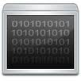
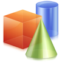

\_\_NOTOC\_\_ **Welcome to CoderDojo's Opensource Knowledge base known
as Kata.**

# [Tutorials](Tutorials.md)

## Mentor Methodologies

  - *Within CoderDojo there is great variety in Dojos. There is no set
    syllabus in any Dojo. One motto that has been used is that in
    CoderDojo the only syllabus is 'how to make a web page'.*
  - [How to include Gamers](How_to_include_Gamers.md)
  - [How to encourage girls](How_to_encourage_girls.md)
  - [The Trouble with a Lecture
    Theater](The_Trouble_with_a_Lecture_Theater.md)
  - [Moving Beyond Scratch](Moving_Beyond_Scratch.md)
  - [Bringing in Outside
    Speakers](Bringing_in_Outside_Speakers.md)
  - [Kids all at Different
    Levels](Kids_all_at_Different_Levels.md)
  - [What do We Teach Next?](What_do_We_Teach_Next?.md)
  - [Dodgy Wifi](Dodgy_Wifi.md)
  - [Involving Parents](Involving_Parents.md)
  - [Mod Minecraft](Mod_Minecraft.md)

# Dojogame

  -   
    [Dojogame](Dojogame.md)
    [HTML](HTML.md),
    [Php](Php.md). From the simplest
    game written in 5 lines of code to Complex persistent universes,
    this section takes you through the unlimited world of online web
    based game creation.

# ScratchTastic\!

  -   
    [ScratchTastic](ScratchTastic.md)
    MIT’s massively popular visual educational programming language
    designed for 6-14 year olds and used by schools and dojos across the
    world.

# Python Power

  -   
    [Python](Python.md)
    A favourite of a huge number of dojo's, python is an interactive,
    object-oriented, extensible programming language.

# The Hardware Laboratory

  -   
    [The Hardware Laboratory](The_Hardware_Laboratory.md)
    Robots, Arduinos, Raspberry Pis, Electronic kits, NodeJs copters,
    Kinects and other controllers.

# The Studio

  -   
    [The Studio](The_Studio.md)
    Audio/Visual tools, programming languages and digital art projects.

# Other Languages And Operating Systems

 [Other Languages And
Operating Systems](Other_Languages_And_Operating_Systems.md)
[Perl](Perl.md),
[C](C.md)
and other mobile languages, [Logo](Logo.md),
[Blockly](Blockly.md) .Net .
[Ubuntu](Ubuntu.md) &
[Rasbian](Rasbian.md)

# The Misc Folder

 [misc](misc.md)
Pre-Categorisation This is where stuff goes during the week, prior to
categorisation at the weekend.
