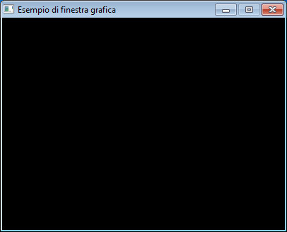

Poter utilizzare la grafica all'interno dei programmi per poter
disegnare, mostrare foto, ascoltare una musica mentre si sta
visualizzando una breve animazione, non è sempre facile.

Spesso i programmatori più esperti scrivono delle librerie che aiutano
gli altri a scrivere programmi grafici in modo molto più semplice.

Una delle librerie più facili da utilizzare e più usate si chiama
**Pygame**, ed è la libreria che verrà utilizzata in questa seconda
parte.

La libreria è composta da tante parti, alcune importanti e
indispensabili, altre altrettanto importanti ma che possono essere
utilizzate se lo si desidera.

# Lo scheletro di un videogioco

Tutti i videogiochi presentano delle caratteristiche comuni come per
esempio

  - visualizzare un'immagine di sfondo
  - leggere i tasti premuti dal giocatore o giocatrice (provenienti da
    una tastiera, dal mouse, dal joystick o da qualsiasi altra
    periferica di input)
  - spostare degli oggetti nello schermo (per esempio oggetti che devono
    essere abbattuti, il percorso che deve seguire una pedina per uscire
    da un labirinto, ecc)

Per poter svolgere tutti questi compiti si parte da un modello comune di
programma chiamato **scheletro** proprio perché rappresenta l'ossatura
di un qualsiasi programma che voglia utilizzare uno di questi compiti
oppure una loro combinazione.

All'nizio capire bene come funziona un modello come quello che verrà
mostrato più avanti, permetterà poi di scrivere nuovi comandi per fare
in modo che lo scheletro diventi un vero e proprio programma.

# Esempio di scheletro pygame

Nell'esempio che segue viene riportato lo schema di uno scheletro da
utilizzare per costruire il proprio videogioco. I commenti presenti, non
necessari, servono per chiarire cosa fa il comando scritto subito dopo.

    #Comando per caricare la libreria pygame
    import pygame
    
    #Comando per le operazioni preparatorie
    stop = False
    
    #Comando per far partire la libreria grafica
    pygame.init()
    
    #Comando per la creazione della finestra grafica
    finestra = pygame.display.set_mode([400,600])
    
    #Comando per scrivere un messaggio nella barra della finestra
    pygame.display.set_caption("Esempio di finestra grafica")
    
    # Inizio del ciclo di gestione del gioco (GAME LOOP)
    while stop == False:
        for event in pygame.event.get():
            if event.type == pygame.QUIT:
                stop = True
    
    # Comando per chiudere la libreria grafica
    pygame.quit()

Con grande sorpresa, una volta eseguito il programma, ecco cosa si
otterrebbe: semplicemente una finestra vuota\!

Lo scopo di questo programma è però un altro: serve per far capire quali
sono i comandi per creare una finestra grafica che per ora è vuota, ma
quando avremo aggiunto i comandi per disegnare figure, animazioni e
anche aggiunto dei suoni, sarà la finestra del nostro videogioco\!

Vediamo comunque in dettaglio il significato di ogni comando per capire
bene come funziona la parte che è stata chiamata **GAME LOOP**.
