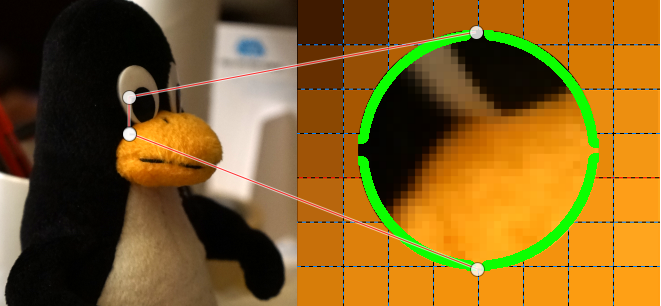
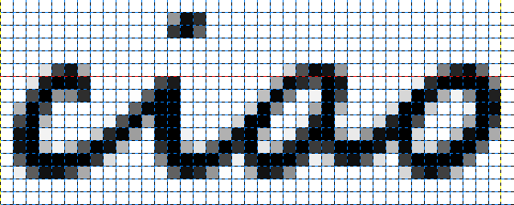

In un gioco sono molto importanti le immagini che vengono disegnate
nella finestra grafica. Queste immagini, se viste da molto vicino, sono
composte da tanti punti talmente vicini che l'occhio umano, alla
distanza giusta, non riesce a distinguerli.

Si può pensare ad un'immagine come una griglia molto simile a quella del
gioco di battaglia navale, ma molto più grande. I punti dell'immagine
possono essere accesi o spenti a seconda di come è fatta l''immagine che
si vuole visualizzare.

Per poter arrivare ad ogni singolo punto occorre seguire questa semplice
regola: per ogni punto dell'immagine devono essere usati due numeri come
questi

    (0,0) oppure (100,20) oppure (101,32) ecc.

che possiamo scrivere anche come

    (x,y)

dove il primo numero (x) rappresenta la posizione orizzontale del punto,
mentre il secondo numero rappresenta la posizione verticale dello stesso
numero (esattamente come succede nella battaglia navale quando si cerca
di scoprire dove sono nascoste le navi da abbattere)
