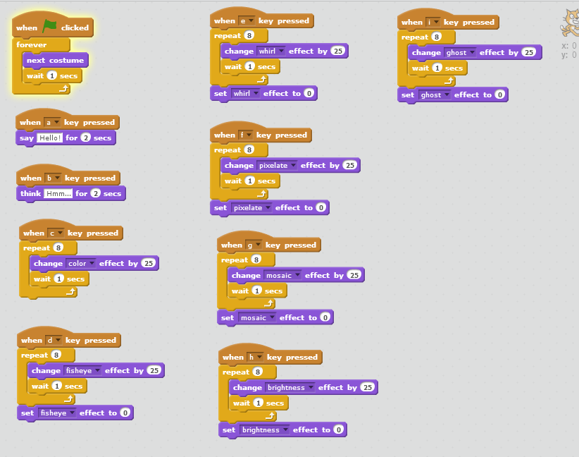

## Summary

 [Ninjas](Ninjas.md) learn to edit sprites in
scratch. 

## Tips for use

You will need to either install Scratch on the
[Ninja](Ninja.md)'s machine or use the [web-based
editor](https://scratch.mit.edu/) in advance of using these cards.

## Content

The following scripts demonstrate the basics of changing how the
character (or sprite) looks

Note: To find yellow blocks go to 'Control' and to find purple blocks go
to 'Looks'

For more information on graphic effects go to
[http://wiki.scratch.mit.edu/wiki/Graphic\_Effect](http://wiki.scratch.mit.edu/wiki/Graphic_Effect.md)

-----

'''Make the character look like it is walking on the spot when the green
flag is clicked '''

Note :

If you click on the costume tab for the cat sprite you will see that
there are 2 costumes.

This script will switch between the two to make the cat look like it is
walking. The wait is put in to slow down the switch between the
costumes.

-----

'''Make the character say 'Hello' when the a key is pressed '''

Note : For 2 seconds a speech bubble will appear about the sprites head
with 'Hello' in it. You can change the number of seconds by clicking on
the 2 and changing.

-----

'''Make the character think 'Hmmm ...' when the b key is pressed '''

Note : For 2 seconds a thought bubble will appear about the sprites head
with 'Hmmm ...' in it. You can change the number of seconds by clicking
on the 2 and changing.

-----

'''Change the colour of the character 8 times when the c key is pressed
'''

Note : There are 200 colours so by changing the colour effect by 25 8
times the character finishes at the colour that it started as. Try
changing the 25 to 1 and the 8 to 200 to see all 200 colours.

-----

'''Change the fisheye effect of the character 8 times when the d key is
pressed '''

Note : The fisheye effect makes the character look like it would through
a wide angle lens. The 'set fisheye effect to 0' at the end is used to
reset the character back to normal.

-----

'''Change the whirl effect of the character 8 times when the e key is
pressed '''

Note : The whirl effect makes the character whirl around its central
point. The 'set whirl effect to 0' at the end is used to reset the
character back to normal.

-----

'''Change the pixelate effect of the character 8 times when the f key is
pressed '''

Note : The pixelate effect makes the character pixelated. The 'set
pixelate effect to 0' at the end is used to reset the character back to
normal.

-----

'''Change the mosaic effect of the character 8 times when the g key is
pressed '''

Note : The mosaic effect makes lots of small copies of the character.
The 'set mosaic effect to 0' at the end is used to reset the character
back to normal.

-----

'''Change the brightness effect of the character 8 times when the h key
is pressed '''

Note : The 'set brightness effect to 0' at the end is used to reset the
character back to normal.

-----

'''Change the ghost effect of the character 8 times when the i key is
pressed '''

Note : The ghost effect fades the sprite in and out. The 'set brightness
effect to 0' at the end is used to reset the character back to normal.

-----

Note: You can also undo the graphc effects above by changing the
relevant effect by a negative number e.g 'change fisheye effect by -25'

-----

You can put all of the above code snippets into one script for a
character and change the look of the character depending on what key has
been pressed

