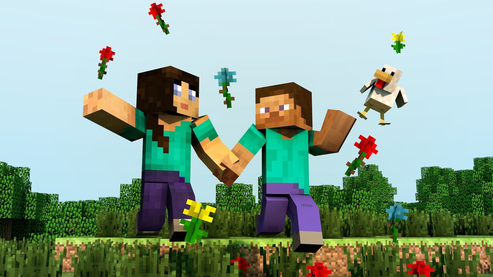

## About Minecraft

The creative and building aspects of Minecraft enable players to build
constructions out of textured cubes in a 3D procedurally generated
world. Other activities in the game include exploration, resource
gathering, crafting, and combat. Multiple gameplay modes are available,
including survival modes where the player must acquire resources to
build the world and maintain health, a creative mode where players have
unlimited resources to build with and the ability to fly, and an
adventure mode where players play custom maps created by other players.

Click on the picture to start playing Minecraft\! 

## PDF Books on Minecraft

| Topic     | Name/Link                                                                                            | Author                                       | Level    | Language | Description                              | Type              | Category |
| --------- | ---------------------------------------------------------------------------------------------------- | -------------------------------------------- | -------- | -------- | ---------------------------------------- | ----------------- | -------- |
| Minecraft | [MINECRAFT Pi Book](http://arghbox.files.wordpress.com/2013/06/minecraftbook.pdf)                    | Craig Richardson                             | Beginner | English  | **Student Reference & Exercises**        | External Resource | E-book   |
| Minecraft | [MINECRAFT Pi Book](http://arghbox.files.wordpress.com/2013/06/teacheredition.pdf)                   | Craig Richardson                             | Beginner | English  | **Teacher Notes**                        | External Resource | E-book   |
| Minecraft | [MINECRAFT Modelling](http://www.designerdojo.ie/#!minecraft-resources/c52k)                         | [Designer Dojo](http://www.designerdojo.ie/) | Beginner | English  | **Modelling and Educational Resources**  | External Resource | E-book   |
| Minecraft | [Discussion forum](http://www.minecraftforum.net/topic/96862-creating-mods-modding-tutorials-21511/) | Minecraft                                    | Beginner | English  | **A Minecraft modding discussion forum** | External Resource | E-book   |
|           |                                                                                                      |                                              |          |          |                                          |                   |          |

**PDF books on Minecraft**

## Tools on Minecraft

"Most mods add content to the game to alter gameplay, change the
creative feel, or give the player more options in how they interact with
the Minecraft world. Most people who mod Minecraft (known as modders)
use Minecraft Coder Pack and either ModLoader or Minecraft Forge to do
so."

| Topic     | Name/Link                                                           | Level    | Language | scope="col" width= 500| Description                                                                                                                                                                                                                                                                                                                                           | Type              | Category |
| --------- | ------------------------------------------------------------------- | -------- | -------- | ----------------------------------------------------------------------------------------------------------------------------------------------------------------------------------------------------------------------------------------------------------------------------------------------------------------------------------------------------------------------------- | ----------------- | -------- |
| Minecraft | **[ScriptCraft](http://scriptcraftjs.org/)**                        | Beginner | English  | Walter Higgins' ScriptCraft extension allows you to write JavaScript programs to build MINECRAFT structures and create mini-games\! Used for a season in [CoderDojo Athenry](http://cdathenry.wordpress.com/). ScriptCraft can lead to learning how to program in Java. Read the whole series of blog posts [ModderDojo](http://cdathenry.wordpress.com/category/modderdojo/) | External Resource | Tool     |
| Minecraft | **[MINECRAFT Forge](http://www.minecraftforge.net/wiki/Main_Page)** | Beginner | English  | is an Application Programming Interface (API) for MINECRAFT, used for modders to create mods and to be compatible with other mods that use MINECRAFT Forge. **[Minecraft Forge Downloads](http://files.minecraftforge.net/)**                                                                                                                                                 | External Resource | Tool     |
| Minecraft | **[Bukkit](https://github.com/Bukkit/Bukkit)**                      | Beginner | English  | [Bukkit](http://wiki.bukkit.org/Main_Page) is a free, open-source, software project that provides the means to extend the popular MINECRAFT multiplayer server.                                                                                                                                                                                                               | External Resource | Tool     |
|           |                                                                     |          |          |                                                                                                                                                                                                                                                                                                                                                                               |                   |          |

**Tools**

  

## Minetest

Minetest is a basic Minecraft that is free and works on Windows, Mac and
Linux. It is described as a 'base to build upon with mods'. The API for
mods is built right in, basically just dumping them into a particular
folder and then turning them on within the game. These mods use Lua.
Look at some tutorials [HERE](http://dev.minetest.net/Intro) and on
Github
[HERE](https://github.com/minetest/minetest/blob/master/doc/lua_api.txt)
**[Find more about Minetest](http://rubenwardy.com/minetest_modding_book/index.html)**

  

## Dojos using Minecraft

 "At
Science Gallery we had a group of seven very enthusiastic children who
made mods to Minecraft Java code, starting with tutorials on youTube.
They helped each other with tasks like installing Eclipse and
decompiling the Java.

The program was WAY bigger than anything they had looked at before, so a
lot of it was about learning to find their way around. "Where is the
constant that controls the size of a TNT explosion?". They got as far as
new crafting recipes and duplicating and very slight change of an entity
- a new kind of cow in Minecraft. They wanted to go much further, but
did not have the maths skills they would have needed, and that was too
high a cliff to climb at that time."

  
**[See more Tutorials from Dojos\!](Minecraft_Tutorials.md)**
