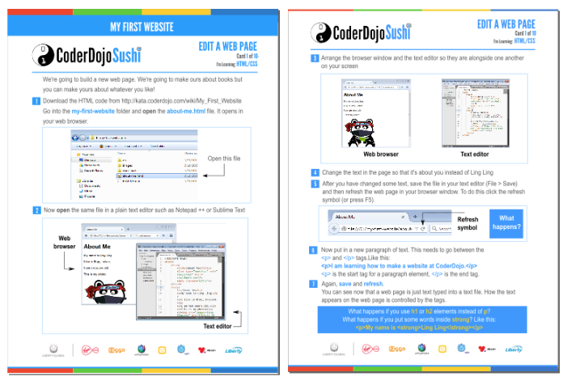

## My First Website (Windows)

**Download the My First Website Sushi card worksheets shown below and
the sample code in a single zip file
[here\>\>.](https://coderdojo.com/wp-content/uploads/2015/06/My-First-Website-Windows.zip)**

The .zip file contains the complete set of Sushi cards (both in PDF and
editable Inkscape (.svg) source files) plus a single starter .html page.
The cards guide a learner through the process of creating a simple web
site consisting of five or six linked pages.

Learners start off by modifying the starter page, replacing Panda Ling
Ling's biographical details and adding their own interests. When they
have worked through all the cards they should have a small site about
themselves and their interests.

## My First Website (Mac)

Coming very soon\!

  - Note: You can use the above Windows cards on Mac though there'll be
    some minor differences with the screenshots and command buttons\!

## Feedback

If you have any feedback or questions about these cards please feel free
to contact info@coderdojo.org.

## How to use the cards

GENERAL NOTES

-----

1\) Copy the about-me.html file and the images and css folders to the
learner's machine before using the cards.

2\) You can also copy the worksheets folder. This contains the PDF and
Inkscape format Sushi Cards.

3\) It's a good idea to ensure that file extensions are visible in
Windows Explorer on the target computer.

4\) Get the learner started by opening about-me.html in a browser and
also in Notepad and then arranging them side-by-side. Then give the
learner Card 1.

### Individual cards

        
