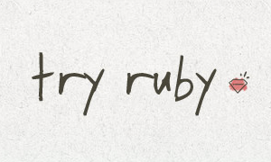

**There are endless ways to learn programming available online. We've
selected our favourite 40 tools to get you started. Whether you're a
complete tyro, robot-hacking hands-on learner, or a 'leet coder looking
for advanced training, you'll find something to help you hone your
skills.**

# Perl

Perl is a family of high-level, general-purpose, interpreted, dynamic
programming languages. The languages in this family include Perl 5 and
Perl 6.

Though Perl is not officially an acronym, there are various backronyms
in use, such as: Practical Extraction and Reporting Language.\] Perl was
originally developed by Larry Wall in 1987 as a general-purpose Unix
scripting language to make report processing easier.\[7\] Since then, it
has undergone many changes and revisions. The latest major stable
revision of Perl 5 is 5.18, released in May 2013. Perl 6, which began as
a redesign of Perl 5 in 2000, eventually evolved into a separate
language. Both languages continue to be developed independently by
different development teams and liberally borrow ideas from one another.

Perl 5 is the current "default Perl" found on most Linux and UNIX
distributions and it's a highly useful and flexible language.

Perl 6 is a completely crafted re-thought of the whole language.
<http://www.perl6.org>

If you are interested in trying out Ruby here are some cool resources
that can
help.  

# Ruby

Ruby is a programming language from Japan (available at ruby-lang.org)
which is revolutionising the web. The beauty of Ruby is found in its
balance between simplicity and power.

You can check out Try Ruby
[here](http://tryruby.org/levels/1/challenges/0).

## Why's Poignant Guide to Ruby

Why the lucky stiff (often abbreviated to Why or \_why), was until 2009,
a prolific writer, cartoonist, artist, and computer programmer notable
for his work with the Ruby programming language. He was known as "one of
the most unusual, and beloved, computer programmers" in the world before
he abruptly disappeared from public view.

Why is best known for his book *Why's Poignant Guide to Ruby* a wacky
graphic novel which teaches Ruby with stories\!

You can check out Why's Poignant Guide to Ruby
[here](http://mislav.uniqpath.com/poignant-guide/).

And while you're at it, why not check out the soundtrack he made to
accompany his guide
[here](http://mislav.uniqpath.com/poignant-guide/soundtrack/).

  

# Mod Minecraft

  - [A minecraft modding discussion
    forum](http://www.minecraftforum.net/topic/96862-creating-mods-modding-tutorials-21511/)
  - Also see the Bukkit module for easy access to the Minecraft MCP

## Experience

At Science Gallery we had a group of seven very enthusiastic children
who made mods to Minecraft Java code, starting with tutorials on
youTube. They helped each other with tasks like installing Eclipse and
decompiling the Java.

The program was WAY bigger than anything they had looked at before, so a
lot of it was about learning to find their way around. "Where is the
constant that controls the size of a TNT explosion?". They got as far as
new crafting recipes and duplicating and very slight change of an entity
- a new kind of cow in Minecraft. They wanted to go much further, but
did not have the maths skills they would have needed, and that was too
high a cliff to climb at that time.

## ScriptCraft

The Scriptcraft javascript control of Minecraft is a more inclusive way
of using minecraft for
coding.

  

[150px|right](file:Keep_Calm.jpg.md)

# What is Python?

"Python is an interpreted, object-oriented, high-level programming
language with dynamic semantics. Its high-level built in data
structures, combined with dynamic typing and dynamic binding, make it
very attractive for Rapid Application Development, as well as for use as
a scripting or glue language to connect existing components together.
Python's simple, easy to learn syntax emphasizes readability and
therefore reduces the cost of program maintenance. Python supports
modules and packages, which encourages program modularity and code
reuse. The Python interpreter and the extensive standard library are
available in source or binary form without charge for all major
platforms, and can be freely distributed." - Find out more at
[Python.org](https://www.python.org/doc/essays/blurb/)

## Getting Started with Python

Check out this great guide for beginners wanting to get started in
Python from the home of Python at
Python.org[\>\>\>.](https://wiki.python.org/moin/BeginnersGuide)

## Learning Python the Hard Way

Here's a great free resource for expanding your knowledge of Python and
ensuring your learn an efficient approach. Check out Learning Python the
Hard Way [here\>\>](http://learnpythonthehardway.org/book/).

## Python on Reddit

Check out this cool SubReddit full of Beginner projects for Python
[here\>\>\>](http://www.reddit.com/r/beginnerprojects/).

## Python & Turtle

Python and Turtle are free tools and when used together are a great way
to get started with a programming language like Python. These are some
notes to get you started.

  - [Getting Started with Python and Turtle](PythonTurtle.md) -
    From Drogheda Dojo. Credit: P Browne / Con Hennessy

<!-- end list -->

  - [100px|link=python mission](file:Mission.png.md) - Credit:
    Liam Friel Coderdojo Bray

<!-- end list -->

  - 
    [invent with python](http://inventwithpython.com/chapters/)

The book and the programs are open source, and are available under a
Creative Commons Attribution-Noncommercial-Share Alike license, meaning
they are free to copy and distribute. See the license for full details.
A print copy can be bought on Amazon.com for $25.

## More Python Resources

Credit: Liam Friel et all - <http://coderdojobray.com/> Bray CoderDojo

  - <http://goo.gl/SED5Od> CoderDojo Bray’s Python Dropbox repository
    (Presentations etc.)
  - <http://inventwithpython.com/> The home page for the eBook we are
    using – plus a LOT more – follow on books, video tutorials etc.

<!-- end list -->

  - <http://bit.ly/ArtProgT> The Art of Programming - tutorials, intro
    to game making & code samples for games
  - <http://bit.ly/PyWiki> Wiki-Book “Non-Programmers Tutorial for
    Python 3”
  - <http://cscircles.cemc.uwaterloo.ca/> Python course, with workable
    examples
  - <http://bit.ly/ComputerScientist> Interactive version of the book
    “How to think like a Computer Scientist”
  - <http://bit.ly/LearnProgram> General tutorial on programming but
    with a strong emphasis on Python 3.x
  - <http://bit.ly/PyTheHardWay> HTML version of the Book “Learn Python
    the Hard Way” (Learn by writing code). NB: Based on Python 2.
  - <http://www.codecademy.com/tracks/python> Some very good tutorials
    (& challenges)
  - <https://www.udemy.com/game-development-fundamentals-with-python/>
    Video Tutorials
  - <http://programarcadegames.com/> “Program Arcade Games with Python &
    Pygame” Another game tutorial
  - <http://www.pythontutor.com/> Tracer & Visualisation tool (NB: Be
    sure to choose Python 3.3 in the dropdown under the code box)
  - <http://docs.python.org/3/tutorial/index.html> Python 3.3 Tutorial
  - <http://wiki.python.org/moin/> The Python Wiki
  - <http://docs.python.org/3/reference/index.html> Full reference for
    the sytax & semantics (very dry…)
  - <http://www.tutorialspoint.com/python/> Another tutorial. Try it &
    see if you like..

Project Examples

  - <http://coolestprojects.org/> Coolest Projects Award site – examples
    of 2012 Projects about half way down the page
  - <http://vimeo.com/61310968> Short Video of 2012 Coolest Project
    Awards
  - <http://inventwithpython.com/dodger.py> Dodger
  - <http://www.pygame.org/project-Varelse+%28Python3%29-1885-.html>
    Varelse

  “Invent with Python” Tools

  - <http://inventwithpython.com/diff/> Diff tool – allows you to
    compare code you’ve typed to the original source code. Helps with
    learning how to spot errors.
  - <http://inventwithpython.com/traces/> Line by line “step through” of
    (so far only some) of the code examples from the book, explaining
    each line.

Other Coding Resources

  - <http://www.codecademy.com/learn> : The Codecademy front page –
    resources for other languages inc. HTML, JavaScript, PHP etc.
  - <http://warmseaorchard.com/Lessons.html> : HTML5 Game Dev Tutorials
  - <http://codingbat.com/python> : Python coding practice. Complete all
    the tests. Good practice\!

  

