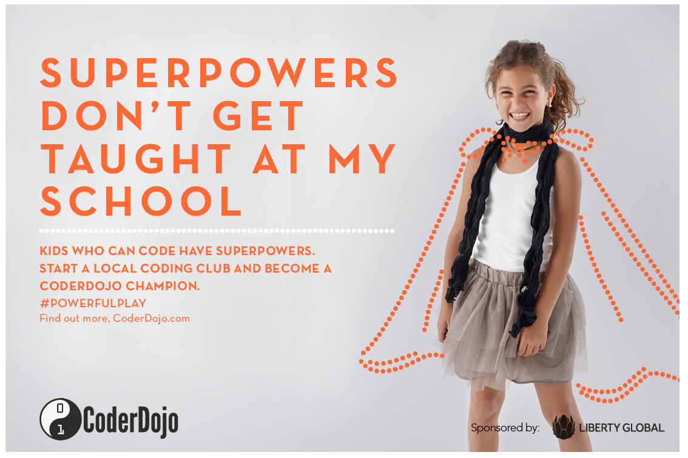

# \#PowerfulPlay

CoderDojo Foundation is working in conjunction with Liberty Global on a
communications campaign to raise awareness about Mentor shortage for
Dojos in the aim to source new Mentors, to volunteer at their local
Dojo, and new CoderDojo Champions, to start Dojos in their regions.

This campaign is aimed to target general public, parents and adults, the
aim is to get more people to become a Coderdojo Champion and start their
own CoderDojo coding club to inspire the next generation for young
coders and digital creators\!

**Download editable version and add your native language
[here](../files/CoderDojo_Powerfulplay.pptx).**

We plan to get as many people as we can to help us spread the word by
sharing the four digital posters (attached below) via their social
networks and within their organisations.

We would like for you to share this campaign to your network to help
CoderDojo reach new audiences\! there is a campaign deck to fill you in
about the campaign
[here](../files/CoderDojo_Powerfulplay.pptx).

Feel free to use the power point file above for pitching the campaign to
volunteer centres and any other organisations that may provide your Dojo
with volunteers. If you have any questions feel free to contact the
Coderdojo Foundation directly.

:\* [Learn more about the campaign
here](https://coderdojo.com/powerfulplay/).

  - \* **Download editable version and add your native language
    [here](../files/CoderDojo_Powerfulplay.pptx).**

## Campaign Posters

## Translations

So far the campaign has been translated into:

**Argentine Spanish**- [Campaña Powerfulplay adaptación
Cordoba](https://github.com/coder-dojo-cordoba/powerfulplay/commit/3613008f7a8529b0196650638d9639ec79515962)
by Leonardo Ludueña

**Latin American Spanish**- [Campaña Powerfulplay Español
neutro](https://github.com/coder-dojo-cordoba/powerfulplay/commit/23f1cd920f39814138e61d32846fc3ef8bea7192)
by Leonardo Ludueña

**Canadian French**- [Canadian French
Translation](https://github.com/coder-dojo-cordoba/powerfulplay/commit/3ff40dda8c4be43f12ceebd8c01ec3f865926e08)
by Benoit Clennett-Sirois, Anahi Aramayo and Leonardo Ludueña

**Italian** - \[[Italian
Translation](../files/CoderDojo_Powerfulplay_italian.pptx)
Translated by Agnese Addone & Carmelo Presicce

## Editable Versions

<File:Given> CoderDojo image (1).jpg
