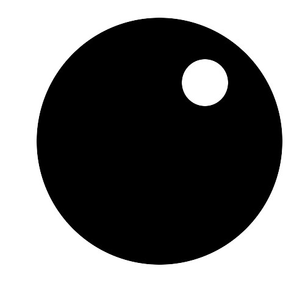

### Programming Languages

#### Scratch

 [Scratch](ScratchTastic.md)

  - 
    
      -   
        MIT’s massively popular visual educational programming language
        designed for 6-14 year olds and used by schools and Dojos across
        the world as a great way of introducing young people to computer
        programming.

  

#### HTML

 [HTML](HTML_Path.md)

  - 
    
      -   
        HyperText Markup Language, commonly referred to as HTML, is the
        standard markup language used to create web pages. It is written
        in the form of HTML elements consisting of tags enclosed in
        angle brackets
(like
        <html>
        ).

  

#### Python

 [Python](Python.md)

  - 
    
      -   
        A favourite of a huge number of Dojo's, python is an
        interactive, object-oriented, extensible programming
language.

  

#### JavaScript

 [Javascript](JavaScript_Path.md)

  - 
    
      -   
        JavaScript is a programming language commonly used in web
        development. Don't confuse it with Java\! Find out how to use it
        here\!

  

#### Ruby

 [Ruby](Ruby.md)

  - 
    
      -   
        Cool resources for learning
Ruby.

  

#### Perl

 [Perl](Perl.md)

  - 
    
      -   
        Find resources for learning Perl
here\!

  

#### Minecraft

 [Minecraft](MINECRAFT.md)

  - 
    
      -   
        For learning to program motivated by
MINECRAFT\!

  

#### Basic Principles

 [Principles](Basic_principles.md)

  - 
    
      -   
        Find the Basic principles to programming
here

  

#### Common Lisp

 [Common Lisp](Common_Lisp.md)

  - 
    
      -   
        Click here to check out great Common Lisp resources\! Common
        Lisp is commonly associated with the development of Artificial
        Intelligence and machine learning\!

  

