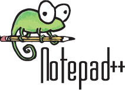
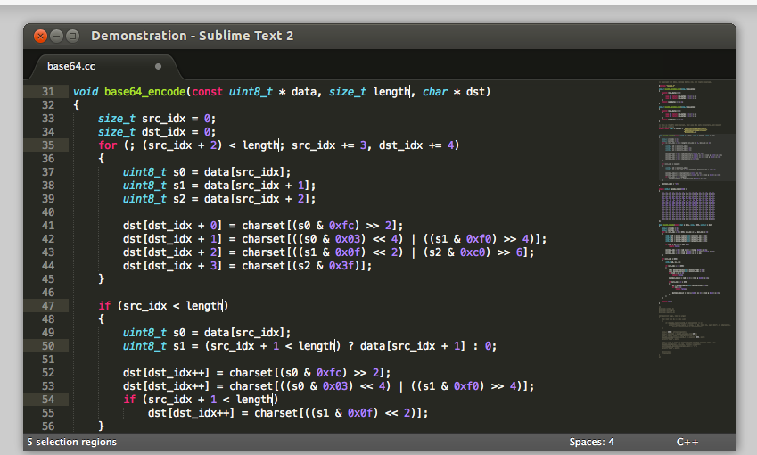

there are only two tools required for mastering the art of dojogame

The first is your editor. Your text editor should allow for syntax
highlighting and line numbering.

## Editor

Linux: Gedit comes as part of the Ubuntu distribution.

Windows: Notepad++ is free and open source

<http://notepad-plus-plus.org/>

  -   
    

Mac: Sublime Not open source but free for the first 80 days. Highly
recommend by Mac Mentors

<http://www.sublimetext.com/>

  -   
    

## Browser

All platforms:

Although you can use tany modern browser for day one we recommend
Firefox. Why?

a) consistency. For the very first hour , reducing all variables is
paramount to getting past the initial fear and excitemt.

b) firefox will allows us complete the first dojogame stage "Build a
game in 5 lines of code" without additional tags such as

<html>

and

<body>

. Not all browsers allow this. (We will continue to monitor this for
changes).

## Zip

Sometimnes a participant will not have their own laptop at hand. Most
platforms as far back as windows xp, will have built in compression
tools to allow particpant zip their folder and email the zipped file to
themselves for future use.
