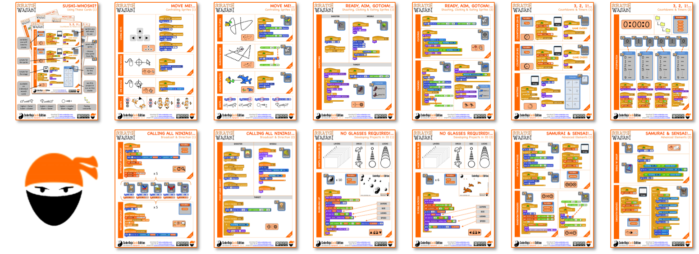

## Summary

 Scratch Sushi Cards with visual design. Mix and match
different ingredients to build your own game\! 

## Tips for use

You can download and print cards individually; alternatively, the whole
collection is available as one file created for EU Code Week.

Another set has also been designed specially for making a pack of
individual, one-sided A5 cards. *(Note that we are still working on
these for some of the A4 examples ... updates to follow\!)*

Example Scratch project files for each of the individual items on the
cards are available in the [Scratch on-line
studio.](https://scratch.mit.edu/studios/1170890/)

All PDF files and example projects are also available on Github:

  - [Scratch Wasabi](https://github.com/ginglexia/scratch-wasabi)

<!-- end list -->

  - [EU Code Week
    Wasabi](https://github.com/ginglexia/eucodeweek-wasabi)

## Content

### Original series

[1: Introduction & how to use these
cards](../files/A4_01_Sushi_Whoshi_v0615.pdf)

[2: Controlling
Sprites](../files/A4_02_Move_Me_v0615.pdf)

[3: Firing, Shooting, &
Eating](../files/A4_03_Ready_Aim_Gotcha_v0615.pdf)

[4: Countdowns &
Timers](../files/A4_04_3-2-1_v0615.pdf)

[5: Using Broadcast to
Control](../files/A4_05_Calling_All_Ninjas_v0615.pdf)

[6: Creating 3D
Effects](../files/A4_06_No_Glasses_Required_v0615.pdf)

[7: Advanced
Elements](../files/A4_07_Samurai_and_Sensai_v0615.pdf)

### EU Code Week Single PDF

[A4_00_All_Cards_vEUCodeWeek.pdf](../files/A4_00_All_Cards_vEUCodeWeek.pdf)

### A5 Cards

Print onto A4, fold, and laminate A5 size\!

[A5_All_Cards_v0615.pdf](../files/A5_All_Cards_v0615.pdf)
