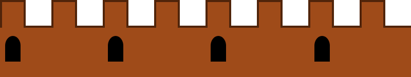

## Summary

 How to make the background of your game move across the
screen, to give the impression that your sprites are moving quickly even
though they are remaining at the same “X” position on the screen.

## Tips for use

You will need to either install Scratch on the
[Ninja](Ninja.md)'s machine or use the [web-based
editor](https://scratch.mit.edu/) in advance of using these cards.

### Required files

Download the three images below and save them into a directory on the
Ninja's machine.

## Content

[ScratchHorizontalBackgroundScroll.pdf](../files/ScratchHorizontalBackgroundScroll.pdf)

### Acknowledgements

The original content and file downloads (including a sample Scratch
project showing the completed work) can be found
[here.](Scratch-Tutorial2.md)

The PDF above is generated from the original Google Doc with the
following slight modifications:

  - formatted headings as per the content on the original Kata page
  - removed a screenshot of renaming Sprites in an older version of
    Scratch
  - removed reference to .rar file as the gifs are provided directly on
    this page
