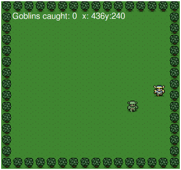

[http://www.lostdecadegames.com/how-to-make-a-simple-html5-canvas-game/
how-to-make-a-simple-html5-canvas-game/](http://www.lostdecadegames.com/how-to-make-a-simple-html5-canvas-game/_how-to-make-a-simple-html5-canvas-game/.md)
by @LostDecadeGames

\[big thanks to Thomas Crevin for finding this gem\]

\<-- Back to [Dojogame](Dojogame.md)

  - 

How would you improve it? What added functions can you think of
adding?

` Coming Soon: Shoot function for player is done next is shoot function for bad guy. ---- Techbot`

Will Knott

  - \-Mahon CoderDojo-

Here Will Knott's variation. Now the object sprite moves too. Wills
tutorial covers seven stages to make it easy to follow the code.

  - 

<https://github.com/willknott/CoderDojo-HTML5-CanvasCatch01>

Techbot

  - \-kata curator-

Here Techbot's variation001. x and y co-rdinates are shown for the hero.

  - 

Here Techbot's variation002. Hero can shoot.

  - 

<!-- end list -->

  - <https://github.com/Techbot/template008>

More Ideas

  - make more maps, north south east west
  - make the bad guy move (as per Will suggestion)
  - Enable the good guy or bad guy to shoot
  - Make the bad guy disappear and reappear at random during the game
    loop.
  - Add objects like gold or mines or chests with random good or bad
    prizes

Even More

  - Fake scrolling background, and the characters all move down...
    forced rolling perspective..
  - Then it becomes a sort of driving game...

<!-- end list -->

  - Turn it up - change the graphics --- flying game

<!-- end list -->

  - turn it back. Collision detection 2 - More walls.. make a maze
  - Bombs, and 4 way explosions - Bommerman
  - Turn it..., the walls become floors, so it becomes a platform game
    (like bomb jack)

<!-- end list -->

  - Turn it up again - flying game throwing out bombs at bad guys this
    time

<!-- end list -->

  - Simple building on top of basic constructs and you'll recreate a
    bunch of cool arcade like titles.

This guy added sound: Raghav :
<https://github.com/livesmart247/simple_canvas_game>

I added a sound effect\!

adding it: var snd = new Audio("audio/goat.wav");

playing it: snd.play(); I couldn't find a chomp sound so I used a goat
:3

  -   - 
Big Thanks to @richtaur Matt Hackett & @geoffblair Geoff Blair At
@LostDecadeGames for creating the tutorial at
[http://www.lostdecadegames.com/how-to-make-a-simple-html5-canvas-game/
how-to-make-a-simple-html5-canvas-game/](http://www.lostdecadegames.com/how-to-make-a-simple-html5-canvas-game/_how-to-make-a-simple-html5-canvas-game/.md)
