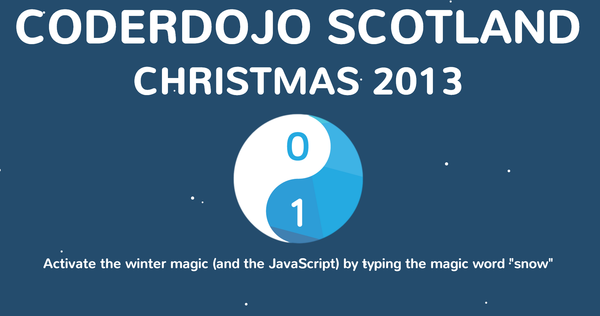

## Summary

 A winter themed educational resource to be used at a
CoderDojo. When the keyword "snow" is entered, snow starts to fall on
the page. 

## Content

### SnowJo

This is a winter themed educational resource to be used at a CoderDojo.
When the keyword "snow" is entered, snow starts to fall on the page.

All the resources for the project can be found on their
[GitHub](https://github.com/CoderDojoScotland/SnowJo)

[Live Demo](http://coderdojo.co/demo/snowjo/)

### Resources

Uses [Snowstorm](http://www.schillmania.com/projects/snowstorm/) by
[Scott Schiller](https://github.com/scottschiller) to produce the snow
effect in JavaScript.

Uses [Keypress](http://dmauro.github.io/Keypress/) by [David
Mauro](https://github.com/dmauro) to trigger the effect when a key
sequence is pressed.

### Authors

[Craig Steele](https://github.com/Craig88) of [CoderDojo
Scotland](http://coderdojoscotland.com/).
