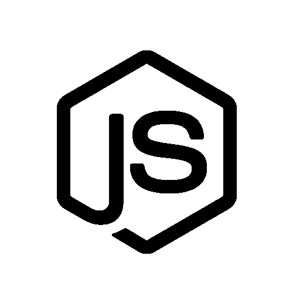

## Popular Paths

The following technologies are popular in Dojos and are a good place to
start.

### Scratch Tutorials

 [Scratch Tutorials](Scratch_Tutorials.md)

  - 
    
      -   
        Scratch is a free programming language and online community
        where you can create your own interactive stories, games, and
        animations.

  

### HTML Tutorials

 [HTML
Tutorials](HTML_Tutorials.md)

  - 
    
      -   
        HyperText Markup Language, commonly referred to as HTML, is the
        standard markup language used to create web pages. It is written
        in the form of HTML elements consisting of tags enclosed in
        angle brackets
(like
        <html>
        ).

  

### Python Tutorials

 [Python
Tutorials](Python_Tutorials.md)

  - 
    
      -   
        Python is a widely used general-purpose, high-level programming
        language. Its design philosophy emphasizes code readability, and
        its syntax allows programmers to express concepts in fewer lines
        of code than would be possible in languages such as C++ or Java.
        Find out which Dojos use it
here\!

  

### Javascript Tutorials

 [Javascript
Tutorials](Javascript_Tutorials.md)

  - 
    
      -   
        JavaScript is a programming language commonly used in web
        development. Don't confuse it with Java\! Find out how to use it
        here\!

  

### App Inventor

 [App Inventor
Tutorials](App_Inventor_Path.md)

  - 
    
      -   
        Learn to make Android apps in your browser\! (No Android device
        needed\!)

  

## Other Paths

### PHP Tutorials

 [PHP
Tutorials](PHP_Tutorials.md)

  - 
    
      -   
        PHP is a server-side scripting language designed for web
        development but also used as a general-purpose programming
        language.

  

### Wearables

 [Wearables Tutorials](Wearables_Path.md)

  - 
    
      -   
        Learn to make electronics you can
wear\!

  

### Arduino

 [Arduino Tutorials](Arduino_Path.md)

  - 
    
      -   
        Arduino is an open-source electronics prototyping platform based
        on flexible, easy-to-use hardware and software. It's intended
        for artists, designers, hobbyists, and anyone interested in
        creating interactive objects or
environments.

  

### Micro:bit

 [Microbit Tutorials](Microbit_Path.md)

  - 
    
      -   
        Learn to code and build hardware projects with the BBC
        Micro:bit.

  

### Raspberry Pi

 [Raspberry Pi Tutorials](Raspberry_Pi_Path.md)

  - 
    
      -   
        Learn hardware and programming with Raspberry
Pi\!

  

## More Technologies

### GIT Tutorials

 [GIT
Tutorials](GIT_Tutorials.md)

  - 
    
      -   
        Git is a free and open source distributed version control system
        designed to handle everything from small to very large projects
        with speed and
efficiency.

  

### XCode Tutorials

[XCode Tutorials](XCode_Tutorials.md)

  - 
    
      -   
        Xcode is an integrated development environment (IDE) containing
        a suite of software development tools developed by Apple for
        developing software for OS X and iOS. Find out how to use it
        here\!

  

### Web Servers Tutorials

 [Web Servers Tutorials](Web_Servers_Tutorials.md)

  - 
    
      -   
        What are Servers and Data centers? Find out
here\!

  

### MySQL Tutorials

[MySQL Tutorials](MySQL_Tutorials.md)

  - 
    
      -   
        MySQL is a widely used open-source relational database
        management system (RDBMS). Learn how to use it
here\!

  

### Node.js Tutorials

 [Node.js Tutorials](Node.js_Tutorials.md)

  - 
    
      -   
        Node.js is a software platform that is used to build scalable
        network (especially server-side)
applications.

  

### Joomla Tutorials

 [Joomla
Tutorials](Joomla_Tutorials.md)

  - 
    
      -   
        Joomla is an award-winning content management system (CMS),
        which enables you to build Web sites and powerful online
        applications.

  

### Minecraft Tutorials

 [Minecraft
Tutorials](Minecraft_Tutorials.md)

  - 
    
      -   
        Here you will find Dojo Made Minecraft Tutorials

  

## Submitting Content

If you have created content you would like to share feel free to post it
on the [CoderDojo
forums](https://forums.coderdojo.com/category/6/learning-resources-for-dojos)
or email it to info@coderdojo.org. You can also submit content [directly
to Kata.](Become_a_Kata_Editor.md)
