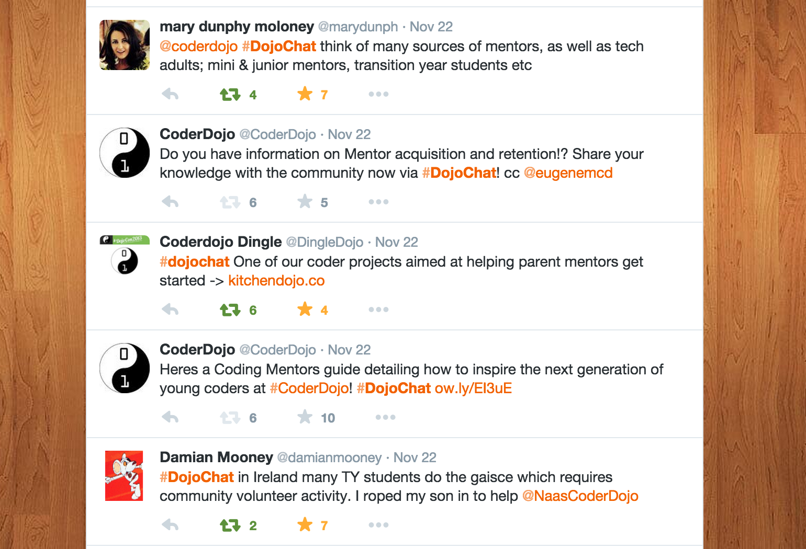

## Twitter

Follow us on Twitter, [@CoderDojo](https://twitter.com/CoderDojo). to
keep up to date with all that's happening in the world of CoderDojo.
Stay in the know about events, opportunities for Dojos and for Ninjas,
tips and tricks for your Dojo and to hear what's happening with the
CoderDojo Foundation.

Champions can set up an account for their Dojos and connect with us on
Twitter @CoderDojo to stay in touch with everything that's going on in
the CoderDojo world and to connect with other Dojos across the globe.

If you have a upcoming Dojo you can use \#DojoDate or if you have
pictures of your Dojo in action please share with \#DojoPics and we will
retweet\!

## \#DojoChat

Once a month CoderDojo community members can get involved in a 24 hour
Tweetathon to chat all things CoderDojo\!

Keep an eye out on Twitter for updates on topics for the next
[\#DojoChat\!](https://twitter.com/search?q=%23dojochat&src=typd)

**You can see other Community Supports we have in place
[here](Community_Support.md)**
