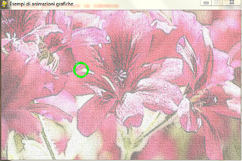

In alcuni casi può essere utile visualizzare un'immagine di sfondo al
posto di un colore.

L'immagine può essere salvata su disco oppure su una chiavetta usb o
qualunque altro supporto, l'importante è che sia salvata nella stessa
cartella dove si trova salvato il listato python utilizzato.

Anche in questo caso le istruzioni necessarie sono state aggiunte allo
scheletro già utilizzato in precedenza:

    #Comando per caricare la libreria pygame
    import pygame
    
    #Comandi per le operazioni preparatorie
    stop = False
    clock = pygame.time.Clock()
    
    #definizione di alcuni colori usati nel programma
    bianco = (255,255,255)
    verde = (0,255,0)
    
    #Comando per attivare la libreria
    pygame.init()
    
    finestra = pygame.display.set_mode([600,375])
    pygame.display.set_caption("Esempi di animazioni grafiche")
    
    # Coordinata orizzontale del cerchio in movimento
    x = 0
    y = 100
    
    # Caricamento immagine da usare come sfondo
    # e che in seguito verrà visualizzata
    sfondo = pygame.image.load("sfondo.jpg")
    
    while stop == False:
        #Avvio del timer
        clock.tick(10)
    
        for event in pygame.event.get():
            if event.type == pygame.QUIT:
                stop = True
    
        # Copia dell'immagine di sfondo nella finestra grafica
        finestra.blit(sfondo,[0,0])
    
        # Disegno di un piccolo cerchio di centro (200,150)
        # (la linea utilizzata avrà uno spessore di 5)
        pygame.draw.circle(finestra, verde, (200,150), 20,5)
    
        # Aggiornamento della finestra grafica 
        pygame.display.flip()
    
    pygame.quit()

Se si utilizza l'immagine di sfondo proposta
([media:Sfondo.jpg](media:Sfondo.jpg.md), il risultato sarà il
seguente:

