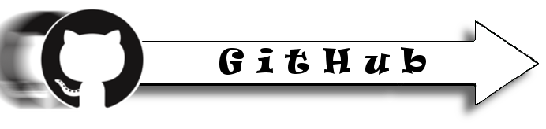

# Dojo Sushi

**Dojo Sushi** is a method of communicating programming concepts in
easy-to-digest, bite-sited chunks (hence Sushi). Dojo Sushi is delivered
on double-sided laminated cards known as Sushi Cards. One card = one
concept.

# Alliance Resources

There are lots of great organisations around the world making free
platforms and resources for young people to learn computer programming.

# Tutorials

Here you will find a variety of tutorials and projects created by the
CoderDojo Community.

# E-Books

Find free E-book resources to learn programming at your own leisure\!

# Minecraft

For learning to program motivated by MINECRAFT\!

# The Hardware Laboratory

Robots, Arduinos, Raspberry Pis and 3D printing\!

# The Studio

Audio, image and video editing tools\!

# GitHub

GitHub is a web-based Git repository hosting service, which offers all
of the distributed revision control and source code management (SCM)
functionality of Git as well as adding its own
features.

# Programming Languages

## Scratch

MIT’s massively popular visual educational programming language designed
for 6-14 year olds and used by schools and Dojos across the world as a
great way of introducing young people to computer programming.

  
\==Python== 

  -   
    A favourite of a huge number of Dojo's, python is an interactive,
    object-oriented, extensible programming language.

## Ruby

  -   
    Cool resources for learning Ruby.

## Perl

  -   
    Find resources for learning [Perl](Perl.md) here\!

## Basic Principles

  -   
    Find the [Basic principles](Basic_principles.md) to
    programming here

[snipte](snipte.md)
